# 02.2 - Network File System


**Antes de começar, execute os passos abaixo para configurar o ambiente caso não tenha feito isso ainda na aula de HOJE: [Preparando Credenciais](../../01-create-codespaces/Inicio-de-aula.md)**

**Todos os comandos de terminal desse execício devem ser executados no Codespaces que você criou na configuração inicial.**

## 📄 Introdução – Melhores Práticas de Performance com Amazon EFS

Neste exercício, você irá aprender como otimizar a performance do **Amazon Elastic File System (EFS)**. O objetivo é explorar as práticas recomendadas para aumentar throughput, reduzir latência e garantir escalabilidade eficiente para aplicações modernas. Durante o laboratório, serão demonstrados ajustes em modos de performance e configurações de throughput, evidenciando como o EFS pode ser ajustado dinamicamente para atender demandas variáveis de carga de trabalho.

Esse exercício é composto por 5 partes:

- **Parte 1**: Configuração do Ambiente para execução do laboratório
- **Parte 2**: Otimização de IOPS
- **Parte 3**: Tamanho do I/O e Frequencia de Sincronização
- **Parte 4**: Multi-Threaded
- **Parte 5**: Delete do Ambiente

## Parte 1 - Configuração do Ambiente

1. Você irá subir uma VPC com varias subents publicas, uma tabela de rota para as subnets publicas, uma instância EC2 para acessar o EFS e um EFS para armazenar os arquivos.
2. Para tal você irá utilizar o Terraform. Inicie com a criação da VPC. Execute o comando abaixo para entrar na pasta do exercício:

```bash
cd /workspaces/fiap-arquitetura-compute-e-storage/02-Storage/02-Network-file-system/rede-vpc/vpc-call
```

3. Execute o comando abaixo para listar os buckets s3 criados na sua conta: 

```bash
aws s3 ls
```
4. Abra o arquivo `state.rf` e altere o nome do bucket s3 iniciado em `base-config-` para o bucket que você pegou no passo anterior. Salve (CTRL+S) o arquivo e feche.

```bash
code state.tf
```
   
   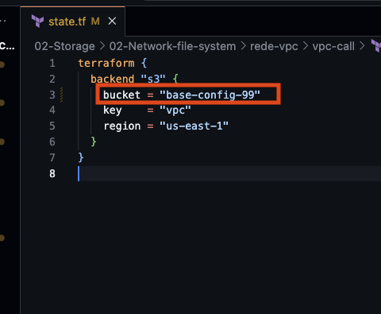

5. Execute o comando abaixo para iniciar o Terraform:

```bash
terraform init
```

   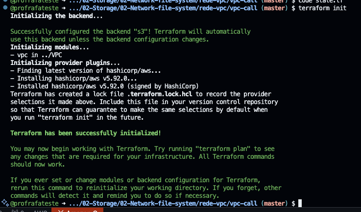

6. Execute o comando abaixo para criar a VPC:

```bash
terraform apply -auto-approve
```

7. Chegou o momento de criar as tabelas de rotas e as subnets. Para entrar na pasta onde esta o terraform execute o comando abaixo:

```bash
cd /workspaces/fiap-arquitetura-compute-e-storage/02-Storage/02-Network-file-system/rede-vpc/RT-call
```

8. Abra o state.rf para alterar o nome do bucket s3 iniciado em `base-config-`. Salve (CTRL+S) o arquivo e feche.

```bash
code state.tf
```

9. Execute o comando abaixo para iniciar o Terraform:

```bash
terraform init
```
10. Execute o comando abaixo para criar as tabelas de rotas e as subnets:

```bash
terraform apply -auto-approve
```
   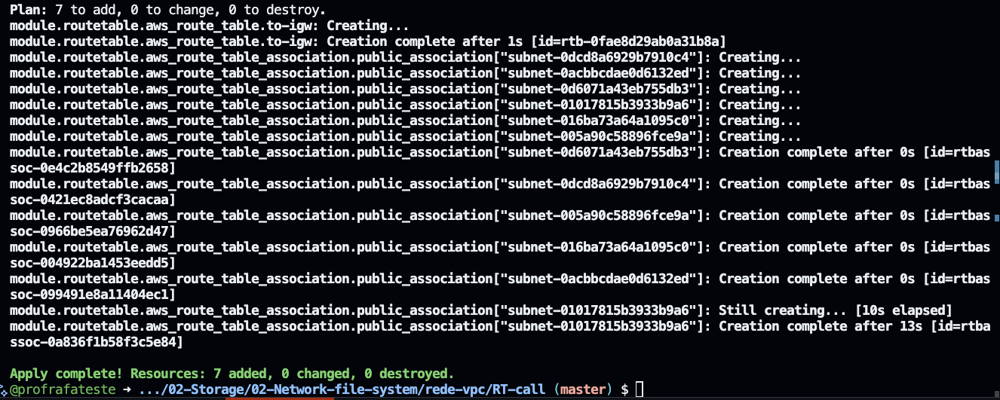

11. Os ultimos passos para a criação do ambiente são subir a instância EC2 e o EFS. Para entrar na pasta onde esta o terraform execute o comando abaixo:

```bash
cd /workspaces/fiap-arquitetura-compute-e-storage/02-Storage/02-Network-file-system/efs-instance
```

12. Abra o state.rf para alterar o nome do bucket s3 iniciado em `base-config-`. Salve (CTRL+S) o arquivo e feche.

```bash
code state.tf
```
13. Execute o comando abaixo para iniciar o Terraform:

```bash
terraform init
```

14. Execute o comando abaixo para criar a instância EC2 e o EFS:

```bash
terraform apply -auto-approve
```

   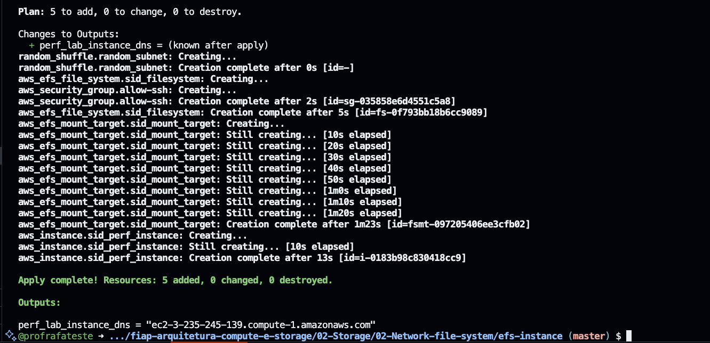

15.  No console da AWS você vai criar o fluxo de logs do Cloudwatch para as sessões de ssh da sequencia do exercicio. Acesse o [link](https://us-east-1.console.aws.amazon.com/cloudwatch/home?region=us-east-1#logsV2:log-groups) e clique em `Criar grupo de logs`.

   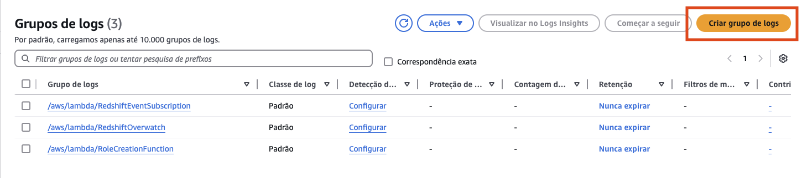
16. Preencha da sequinte forma e clique em `Criar`:
   - Nome do grupo de logs: `/ssm/ssh`
   - Configuração de retenção: `3 Dias`

   

17. No console da aws vá até o serviço system manager configurar os logs das sessões ssh. Acesse o [link](https://us-east-1.console.aws.amazon.com/systems-manager/session-manager/preferences?region=us-east-1)

18. Clique em `Editar` 

   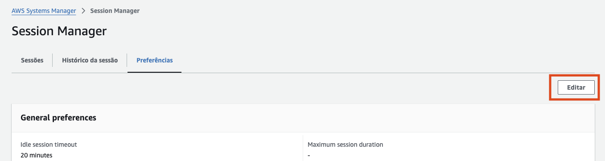

19. Na seção `CloudWatch Logging` preencha da seguinte forma:
    1.  CloudWatch logging: `Marcado`
    2.  Enforce encryption: `Desmarcado`
    3.  Grupo de logs do CloudWatch: `Selecionar um grupo da lista
    4.  Selecione o grupo de logs criado anteriormente: `/ssm/ssh`
    
   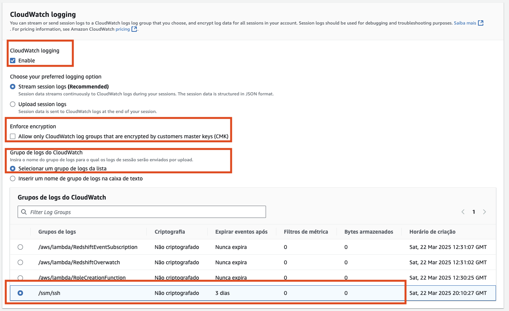
20. Na seção `Linux shell profile` coloque o seguinte texto e clique em `Salvar` no final da página:

```bash
bash
sudo su -
```

21. Primeiramente você deve entrar na instância EC2 criada. Para tal, acesse o console AWS e vá até o [serviço EC2](https://us-east-1.console.aws.amazon.com/ec2/home?region=us-east-1#Instances:instanceState=running).

   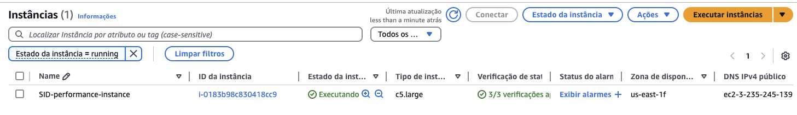

22. Selecione na instância `SID-performance-instance` e clique em conectar na parte superior da tela.

   

23. Clique na aba ``gerenciador de sessões`` e clique em `Conectar`. Isso vai abrir uma nova aba do navegador com o terminal da instância EC2.

   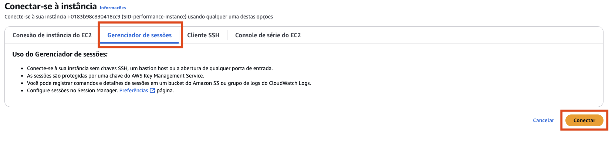

   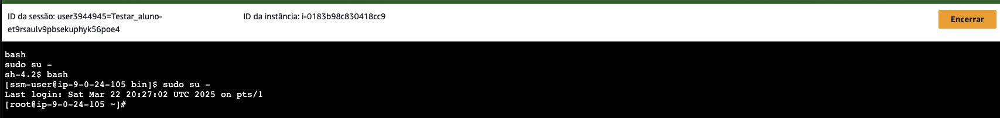

24. Execute o comando abaixo para o AWS Cli configurar a região e o output:

```bash
mkdir -p ~/.aws
aws configure set region us-east-1
aws configure set output json
```

25.  Para ter certeza que o EFS foi montado corretamente, execute o comando abaixo:

```bash
df -h
```
   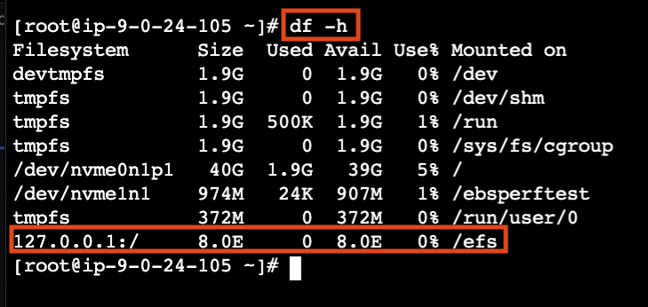


**Caso o EFS não tenha sido montado, execute o comando abaixo:**

```bash
sudo yum install -y amazon-efs-utils -y

FS_ID=$(aws efs describe-file-systems \
  --query "FileSystems[?Name=='SID-efs'].FileSystemId" \
  --output text)

sudo mkdir -p /efs
sudo mount -t efs ${FS_ID}:/ /efs
mount | grep /efs
df -h
```

   

## Parte 2 - Otimização de IOPS

Os testes de desempenho do Amazon Elastic File System (EFS) são fundamentais para garantir que suas aplicações sejam executadas de forma eficiente e escalável. No contexto do exercício disponível na aula de práticas recomendadas de desempenho de armazenamento da AWS, os testes visam otimizar as operações de IOPS (Input/Output Operations Per Second), que são cruciais para o desempenho geral do sistema.

Esses testes são importantes porque permitem avaliar como o EFS se comporta sob diferentes cargas de trabalho, ajudando a identificar possíveis gargalos e oportunidades de otimização. Ao entender como o EFS lida com operações intensivas, você pode ajustar suas configurações para melhor atender às necessidades específicas da sua aplicação, garantindo uma experiência de usuário mais rápida e confiável.

Além disso, os testes de desempenho do EFS ajudam a validar a eficácia das práticas recomendadas de configuração e escalabilidade, permitindo que você tome decisões informadas sobre como melhorar o desempenho do seu sistema de arquivos na nuvem. Isso é especialmente relevante em ambientes de produção, onde a performance e a escalabilidade são essenciais para o sucesso da aplicação.

1. Dentro da instância EC2 criada para o EFS, execute o comando abaixo para teste de criar 1024 arquivos vazios(zero bytes) e medir o tempo de execução:

```bash
directory=$(echo $(uuidgen)| grep -o ".\\{6\\}$")    
mkdir -p /efs/tutorial/touch/${directory}  
time for i in {1..1024}; do  
touch /efs/tutorial/touch/${directory}/test-1.3-$i;  
done;
```

   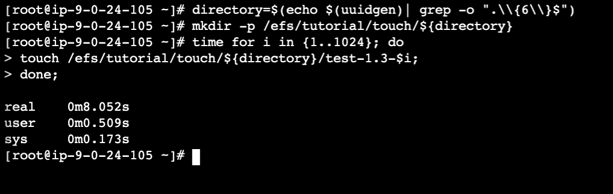

<details>
<summary> 
<b>Explicação do comando de criação de arquivos vazios</b>
</summary>
<blockquote>
### 1. **Geração de Diretório Único**
   ```bash
   directory=$(echo $(uuidgen)| grep -o ".\\{6\\}$")
   ```
   - **`uuidgen`**: Este comando gera um identificador universal único (UUID). O UUID é uma string de 32 caracteres que é usada para identificar objetos de forma única.
   - **`echo $(uuidgen)`**: Executa o comando `uuidgen` e imprime o resultado.
   - **`grep -o ".\\{6\\}$"`**: Extrai os últimos seis caracteres do UUID gerado. Isso é feito para criar um nome de diretório curto e único. O padrão `".\\{6\\}$"` significa que ele captura exatamente seis caracteres (`\\{6\\}`) no final da linha (`$`).
   - **`directory=$(...)`**: Atribui o resultado da extração dos seis últimos caracteres do UUID à variável `directory`.

### 2. **Criação do Diretório**
   ```bash
   mkdir -p /efs/tutorial/touch/${directory}
   ```
   - **`mkdir`**: Comando para criar diretórios.
   - **`-p`**: Opção que permite criar todos os diretórios pais necessários se eles não existirem. Isso evita erros caso o diretório pai não exista.
   - **`/efs/tutorial/touch/${directory}`**: Caminho onde o diretório será criado. O `${directory}` é substituído pelo valor gerado na linha anterior.

### 3. **Criação de Arquivos Zero-Byte**
   ```bash
   time for i in {1..1024}; do
     touch /efs/tutorial/touch/${directory}/test-1.3-$i;
   done;
   ```
   - **`time`**: Mede o tempo necessário para executar o comando seguinte. Isso é útil para avaliar o desempenho do EFS ao criar muitos arquivos.
   - **`for i in {1..1024}; do ... done;`**: Executa um loop que itera de 1 a 1024.
   - **`touch /efs/tutorial/touch/${directory}/test-1.3-$i;`**: Cria um arquivo vazio no diretório especificado. O nome do arquivo inclui o valor de `$i` para cada iteração do loop.

### Impacto no EFS

Este comando tem o seguinte impacto no EFS:

- **Teste de IOPS**: A criação de 1.024 arquivos zero-byte em um curto período de tempo testa a capacidade do EFS de lidar com um alto volume de operações de entrada/saída. Isso ajuda a avaliar o desempenho do sistema de arquivos em termos de latência e throughput.
- **Desempenho e Escalabilidade**: Ao medir o tempo necessário para criar esses arquivos, você pode avaliar como o EFS se comporta sob cargas de trabalho intensivas. Isso é útil para identificar possíveis gargalos e otimizar a configuração do EFS para melhor atender às necessidades da sua aplicação.
- **Monitoramento de Desempenho**: Este teste pode ser usado em conjunto com métricas do CloudWatch para monitorar o desempenho do EFS e ajustar as configurações conforme necessário.

Em resumo, este comando é uma ferramenta útil para testar e otimizar o desempenho do EFS em termos de IOPS, ajudando a garantir que o sistema de arquivos esteja configurado para atender às demandas específicas da sua aplicação.
</blockquote>
</details>

2. Agora vamos criar os mesmos 1024 arquivos vazios, mas dessa vez em paralelo. Execute o comando abaixo:

```bash
directory=$(echo $(uuidgen)| grep -o ".\\{6\\}$")    
mkdir -p /efs/tutorial/touch/${directory}    
time seq 1 1024 | parallel --will-cite -j 128 touch /efs/tutorial/touch/${directory}/test-1.4-{}
```

   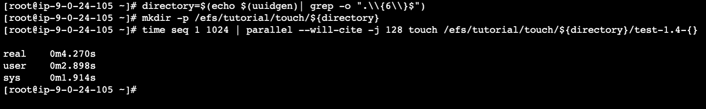

<details>
<summary>
<b>Explicação do comando de criação de arquivos em paralelo</b>
</summary>
<blockquote>
### 1. **Geração de Diretório Único e Criação do Diretório**
   ```bash
   directory=$(echo $(uuidgen)| grep -o ".\\{6\\}$")
   mkdir -p /efs/tutorial/touch/${directory}
   ```
   - Essas linhas são idênticas ao comando anterior. Elas geram um diretório único e o criam no caminho especificado.

### 2. **Criação de Arquivos em Paralelo**
   ```bash
   time seq 1 1024 | parallel --will-cite -j 128 touch /efs/tutorial/touch/${directory}/test-1.4-{}
   ```
   - **`seq 1 1024`**: Gera uma sequência numérica de 1 a 1024. Essa sequência é usada para criar 1.024 arquivos.
   - **`parallel --will-cite -j 128`**: Executa o comando seguinte em paralelo, utilizando múltiplos processos.
     - **`--will-cite`**: Essa opção não é padrão em muitas versões do `parallel`. Ela pode ser ignorada ou removida se não for suportada.
     - **`-j 128`**: Especifica o número máximo de trabalhos que podem ser executados simultaneamente. Neste caso, até 128 processos são executados em paralelo.
   - **`touch /efs/tutorial/touch/${directory}/test-1.4-{};`**: Cria um arquivo vazio no diretório especificado. O `{}` é substituído pelo valor gerado pela sequência `seq`. O nome do arquivo inclui o número da sequência.

### Diferenças em Relação ao Comando Anterior

- **Paralelização**: A principal diferença é a utilização do comando `parallel` para executar a criação dos arquivos em paralelo. Isso aumenta significativamente a velocidade do processo, pois múltiplos arquivos são criados simultaneamente.
- **Taxa de Criação de Arquivos**: Com a paralelização, o comando pode criar arquivos muito mais rapidamente do que o comando anterior, que usava um loop sequencial. Isso coloca uma carga mais intensa no sistema de arquivos, testando sua capacidade de lidar com operações concorrentes.

### Impacto no EFS

- **Teste de IOPS em Paralelo**: Este comando testa a capacidade do EFS de lidar com um alto volume de operações de entrada/saída em paralelo, o que é mais próximo de cenários reais onde muitos processos podem estar acessando o sistema de arquivos simultaneamente.
- **Desempenho sob Carga Paralela**: Ao medir o tempo necessário para criar esses arquivos em paralelo, você pode avaliar melhor como o EFS se comporta sob cargas de trabalho intensivas e concorrentes, o que é crucial para aplicações que exigem alta escalabilidade e desempenho.

Em resumo, este comando é uma ferramenta poderosa para testar o desempenho do EFS em cenários de alta concorrência, ajudando a garantir que o sistema de arquivos esteja configurado para atender às demandas específicas da sua aplicação.

</blockquote>
</details>

3. No ultimo teste de IOPS, vamos criar 1024 arquivos vazios, mas dessa vez em diretórios separados. Execute o comando abaixo:

```bash
directory=$(echo $(uuidgen)| grep -o ".\\{6\\}$")   
mkdir -p /efs/tutorial/touch/${directory}/{1..32}  
time seq 1 32 | parallel --will-cite -j 32 touch /efs/tutorial/touch/${directory}/{}/test1.5{1..32}
```

   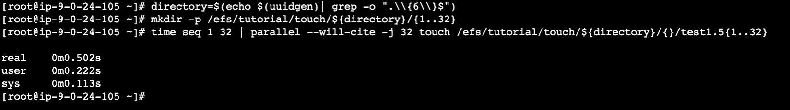

<details>
<summary>
<b>Explicação do comando de criação de arquivos em diretórios separados</b>
</summary>
<blockquote>

### Comando

```bash
directory=$(echo $(uuidgen)| grep -o ".\\{6\\}$")
mkdir -p /efs/tutorial/touch/${directory}/{1..32}
time seq 1 32 | parallel --will-cite -j 32 touch /efs/tutorial/touch/${directory}/{}/test1.5{1..32}
```

### Explicação

1. **Geração de Diretório Único e Criação de Subdiretórios**:
   ```bash
   directory=$(echo $(uuidgen)| grep -o ".\\{6\\}$")
   mkdir -p /efs/tutorial/touch/${directory}/{1..32}
   ```
   - Essas linhas geram um diretório único e criam 32 subdiretórios dentro dele, numerados de 1 a 32.

2. **Criação de Arquivos em Paralelo**:
   ```bash
   time seq 1 32 | parallel --will-cite -j 32 touch /efs/tutorial/touch/${directory}/{}/test1.5{1..32}
   ```
   - **`seq 1 32`**: Gera uma sequência numérica de 1 a 32.
   - **`parallel --will-cite -j 32`**: Executa o comando seguinte em paralelo, utilizando até 32 processos simultâneos.
   - **`touch /efs/tutorial/touch/${directory}/{}/test1.5{1..32}`**: Este comando tem um problema, pois a expansão `{}` e `{1..32}` não é feita corretamente dentro do `parallel`. A intenção parece ser criar um arquivo em cada um dos 32 subdiretórios, mas a sintaxe está incorreta.

### Impacto no EFS

- **Teste de IOPS em Subdiretórios**: Este comando testa a capacidade do EFS de lidar com operações de entrada/saída em múltiplos subdiretórios simultaneamente, o que pode ser útil para simular cenários onde dados são distribuídos em várias pastas.

</blockquote>
</details>


### Conclusão do teste de IOPS
Aqui está um texto que resume e compara os três comandos utilizados para testar o desempenho do Amazon Elastic File System (EFS):

---

##### Conclusão

Nesta seção, exploramos três diferentes comandos para testar o desempenho do Amazon EFS em termos de IOPS. Cada comando tem suas próprias características e é adequado para diferentes cenários:

##### Comparação

- **Sequencial vs. Paralelo**: O comando paralelo é mais eficaz para testar o desempenho do EFS em cenários de alta concorrência, enquanto o comando sequencial é mais adequado para testar operações lineares.
- **Subdiretórios**: O uso de subdiretórios pode ajudar a distribuir a carga de trabalho de forma mais uniforme, simulando cenários reais onde os dados são organizados em pastas separadas.

Em resumo, a escolha do comando depende do tipo de carga de trabalho que você deseja simular. Para testes de concorrência intensa, o comando paralelo é mais adequado. Para simular a distribuição de dados em subpastas, o comando que utiliza subdiretórios é mais apropriado.

---

## Parte 3 - Tamanho do I/O e Frequencia de Sincronização


#### Introdução ao Tamanho do I/O e Frequência de Sincronização

Ao trabalhar com o Amazon Elastic File System (EFS), entender como o tamanho do I/O e a frequência de sincronização afetam o desempenho é crucial para otimizar o uso do sistema de arquivos. O tamanho do I/O refere-se ao tamanho dos blocos de dados que são lidos ou escritos em cada operação, enquanto a frequência de sincronização determina quando os dados são confirmados como escritos no disco.

Esses parâmetros são importantes porque influenciam diretamente a latência e o throughput do sistema. Por exemplo, operações de I/O maiores podem aumentar o throughput geral, pois a sobrecarga por operação é distribuída sobre uma [quantidade maior de dados](https://docs.aws.amazon.com/efs/latest/ug/performance.html). No entanto, sincronizar após cada bloco pode reduzir significativamente o desempenho, enquanto sincronizar após cada arquivo pode otimizar o [uso do sistema](https://000068.awsstudygroup.com/4-efsstorageperformance/4.2-syncfrequency/).

Nesta seção, vamos realizar testes para demonstrar como diferentes tamanhos de I/O e frequências de sincronização afetam o desempenho do EFS. Isso incluirá a criação de arquivos utilizando diferentes tamanhos de bloco e frequências de sincronização, medindo o tempo necessário para completar essas operações e avaliando o impacto no throughput geral do sistema. Esses testes são essenciais para entender como ajustar as configurações do EFS para atender às necessidades específicas da sua aplicação, garantindo um desempenho ótimo e escalabilidade adequada.

1. Vamos começar escrevendo um arquivo de 2GB com um bloco de 1MB onde o sync é executado depois de cada arquivo. Execute o comando abaixo:

```bash
sudo mkdir -p /efs/tutorial/{dd,touch,rsync,cp,parallelcp,parallelcpio}/
time dd if=/dev/zero of=/efs/tutorial/dd/2G-dd-$(date +%Y%m%d%H%M%S.%3N) \
bs=1M count=2048 status=progress conv=fsync
```

   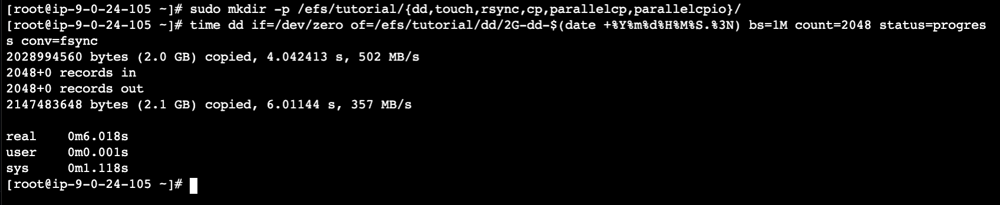

<details>
<summary>
<b>Explicação do comando de escrita de arquivo de 2GB com bloco de 1MB com sync após cada arquivo</b>
</summary>
<blockquote>

### Comando Desmembrado

```bash
time dd if=/dev/zero of=/efs/tutorial/dd/2G-dd-$(date +%Y%m%d%H%M%S.%3N) \
bs=1M count=2048 status=progress conv=fsync
```

- **`time`**: Este comando mede o tempo necessário para a execução do comando `dd`. Ele fornece informações sobre quanto tempo o processo levou para ser concluído.

- **`dd`**: O comando `dd` é uma ferramenta de cópia de dados em baixo nível que pode ser usada para criar arquivos, copiar dados entre dispositivos, e realizar outras operações de E/S.

- **`if=/dev/zero`**: Especifica a entrada (`if`) como `/dev/zero`, que é um dispositivo especial que fornece zeros infinitamente. Isso significa que o arquivo criado será preenchido com zeros.

- **`of=/efs/tutorial/dd/2G-dd-$(date +%Y%m%d%H%M%S.%3N)`**: Especifica a saída (`of`) como um arquivo no EFS. O nome do arquivo inclui a data e hora atual, garantindo que cada arquivo tenha um nome único.

- **`bs=1M`**: Define o tamanho do bloco (`bs`) como 1 megabyte. Isso significa que os dados serão lidos e escritos em blocos de 1 MB.

- **`count=2048`**: Limita o número de blocos a serem copiados. Com um tamanho de bloco de 1 MB, isso resulta em um arquivo de 2 GB (2048 blocos * 1 MB por bloco).

- **`status=progress`**: Mostra o progresso da operação em tempo real, incluindo a taxa de transferência e o tempo restante.

- **`conv=fsync`**: Garante que os dados sejam sincronizados fisicamente no disco após cada bloco ser escrito. Isso assegura que os dados estejam completamente escritos no disco antes de prosseguir, mas pode afetar o desempenho devido à sobrecarga adicional de I/O.

### Impacto no EFS

1. **Desempenho**: O uso de um tamanho de bloco de 1 MB (`bs=1M`) pode ser adequado para muitas operações de E/S, mas a sincronização após cada bloco (`conv=fsync`) pode reduzir o desempenho geral, pois garante que cada bloco seja completamente escrito antes de prosseguir. Isso pode ser útil para garantir a integridade dos dados, mas pode aumentar o tempo de execução.

2. **Integridade dos Dados**: A sincronização dos dados após cada bloco ajuda a garantir que os dados sejam escritos corretamente no EFS, minimizando o risco de corrupção em caso de falhas.

3. **Uso de Recursos**: A criação de um arquivo de 2 GB pode consumir espaço no EFS e afetar o uso geral de recursos, especialmente se for executada em grande escala.

4. **Monitoramento**: O uso de `status=progress` permite monitorar a operação em tempo real, o que é útil para entender o progresso e o desempenho da operação.

Em resumo, o comando é útil para testar o desempenho do EFS em operações de escrita, garantindo a integridade dos dados, mas pode ter um impacto no desempenho devido à sincronização frequente.

</blockquote>
</details>

2. Agora você vai o mesmo arquivo de 2GB mas utilizando blocos de 16MB e sync depois de cada arquivo:

```bash
time dd if=/dev/zero of=/efs/tutorial/dd/2G-dd-$(date +%Y%m%d%H%M%S.%3N) \
bs=16M count=128 status=progress conv=fsync
```

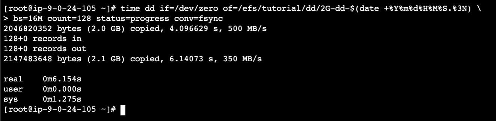

<details>
<summary>
<b>Explicação do comando de escrita de arquivo de 2GB com bloco de 16MB com sync após cada arquivo</b>
</summary>
<blockquote>

### Comando Desmembrado

```bash
time dd if=/dev/zero of=/efs/tutorial/dd/2G-dd-$(date +%Y%m%d%H%M%S.%3N) \
bs=16M count=128 status=progress conv=fsync
```

- **Tamanho de Bloco (bs=16M)**: O uso de um tamanho de bloco maior (16 MB) pode melhorar o desempenho geral ao escrever grandes quantidades de dados, pois reduz o número de operações de E/S necessárias. Isso é especialmente benéfico em sistemas que suportam operações de E/S em blocos maiores, como o EFS.

- **Sincronização (conv=fsync)**: A sincronização após cada bloco garante que os dados sejam escritos fisicamente no disco antes de prosseguir, o que ajuda a prevenir perda de dados em caso de falhas. No entanto, isso pode aumentar o tempo de execução devido à sobrecarga adicional de I/O.

### Impacto no EFS

1. **Desempenho**: O uso de um tamanho de bloco maior (16 MB) pode melhorar a taxa de transferência de dados em comparação com um tamanho de bloco menor (1 MB), especialmente em sistemas otimizados para operações de E/S em blocos maiores. No entanto, a sincronização frequente pode reduzir o desempenho geral.

2. **Integridade dos Dados**: A sincronização após cada bloco ajuda a garantir que os dados sejam escritos corretamente no EFS, minimizando o risco de corrupção em caso de falhas.

3. **Uso de Recursos**: A criação de um arquivo de 2 GB pode consumir espaço no EFS e afetar o uso geral de recursos, especialmente se for executada em grande escala.

4. **Monitoramento**: O uso de `status=progress` permite monitorar a operação em tempo real, o que é útil para entender o progresso e o desempenho da operação.

### Considerações Adicionais

- **Paralelização**: Para melhorar o desempenho em operações de escrita no EFS, considerar o uso de múltiplas threads ou processos em paralelo pode ser benéfico, pois o EFS é projetado para lidar com cargas de trabalho paralelas de forma eficiente.

- **Comparação com EBS**: Em comparação com o Amazon Elastic Block Store (EBS), o EFS tende a se beneficiar mais de operações paralelas, enquanto o EBS pode oferecer melhor desempenho em operações sequenciais.

</blockquote>
</details>

3. Agora o teste será criar o arquivo de 2GB e blocos de 1MB novamente. Porém com sync após cada bloco.

```bash
time dd if=/dev/zero of=/efs/tutorial/dd/2G-dd-$(date +%Y%m%d%H%M%S.%3N) \
bs=1M count=2048 status=progress oflag=sync
```

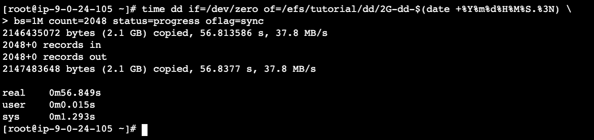

<details>
<summary>
<b>Explicação do comando de escrita de arquivo de 2GB com bloco de 1MB com sync após cada bloco</b>
</summary>
<blockquote>

### Comando Desmembrado

```bash
time dd if=/dev/zero of=/efs/tutorial/dd/2G-dd-$(date +%Y%m%d%H%M%S.%3N) \
bs=1M count=2048 status=progress oflag=sync
```

- **Tamanho de Bloco (bs=1M)**: O uso de um tamanho de bloco de 1 MB pode ser adequado para muitas operações de E/S, mas pode não ser o mais eficiente em termos de desempenho em comparação com tamanhos de bloco maiores.

- **Sincronização (oflag=sync)**: A sincronização após cada bloco garante que os dados sejam escritos fisicamente no disco antes de prosseguir, o que ajuda a prevenir perda de dados em caso de falhas. No entanto, isso pode aumentar o tempo de execução devido à sobrecarga adicional de I/O.

### Impacto no EFS

1. **Desempenho**: O uso de um tamanho de bloco de 1 MB pode não ser o mais eficiente em termos de desempenho, especialmente quando comparado a tamanhos de bloco maiores como 16 MB. A sincronização frequente pode reduzir ainda mais o desempenho geral.

2. **Integridade dos Dados**: A sincronização após cada bloco ajuda a garantir que os dados sejam escritos corretamente no EFS, minimizando o risco de corrupção em caso de falhas.

3. **Uso de Recursos**: A criação de um arquivo de 2 GB pode consumir espaço no EFS e afetar o uso geral de recursos, especialmente se for executada em grande escala.

4. **Monitoramento**: O uso de `status=progress` permite monitorar a operação em tempo real, o que é útil para entender o progresso e o desempenho da operação.

### Considerações Adicionais

- **Paralelização**: Para melhorar o desempenho em operações de escrita no EFS, considerar o uso de múltiplas threads ou processos em paralelo pode ser benéfico, pois o EFS é projetado para lidar com cargas de trabalho paralelas de forma eficiente.

- **Comparação com EBS**: Em comparação com o Amazon Elastic Block Store (EBS), o EFS tende a se beneficiar mais de operações paralelas, enquanto o EBS pode oferecer melhor desempenho em operações sequenciais.

### Diferenças entre `conv=fsync` e `oflag=sync`

- **`conv=fsync`**: Esta opção garante que os dados sejam sincronizados fisicamente no disco após cada bloco ser escrito, mas pode ser menos eficiente em alguns casos devido à forma como o `dd` lida com a sincronização.

- **`oflag=sync`**: Esta opção fornece uma sincronização mais direta e eficiente, garantindo que os dados sejam escritos fisicamente no disco após cada bloco, sem a sobrecarga adicional que pode ocorrer com `conv=fsync`. No entanto, ambos os métodos visam garantir a integridade dos dados, mas `oflag=sync` pode ser mais adequado para operações que exigem sincronização frequente.

</blockquote>
</details>

4. Por último o teste é criar o arquivo de 2GB com blocos de 16MB e sync a cada bloco.

```bash
time dd if=/dev/zero of=/efs/tutorial/dd/2G-dd-$(date +%Y%m%d%H%M%S.%3N) \
bs=16M count=128 status=progress oflag=sync
```

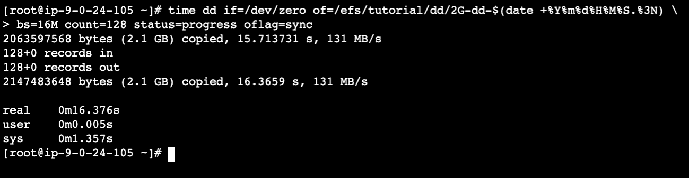

<details>
<summary>
<b>Explicação do comando de escrita de arquivo de 2GB com bloco de 16MB com sync após cada bloco</b>
</summary>
<blockquote>

### Comando Desmembrado

```bash
time dd if=/dev/zero of=/efs/tutorial/dd/2G-dd-$(date +%Y%m%d%H%M%S.%3N) \
bs=16M count=128 status=progress oflag=sync
```

- **Tamanho de Bloco (bs=16M)**: O uso de um tamanho de bloco maior (16 MB) pode melhorar o desempenho geral ao escrever grandes quantidades de dados, pois reduz o número de operações de E/S necessárias. Isso é especialmente benéfico em sistemas que suportam operações de E/S em blocos maiores, como o EFS.

- **Sincronização (oflag=sync)**: A sincronização após cada bloco garante que os dados sejam escritos fisicamente no disco antes de prosseguir, o que ajuda a prevenir perda de dados em caso de falhas. A opção `oflag=sync` fornece uma sincronização mais direta e eficiente em comparação com `conv=fsync`.

### Impacto no EFS

1. **Desempenho**: O uso de um tamanho de bloco maior (16 MB) pode melhorar a taxa de transferência de dados em comparação com tamanhos de bloco menores. A sincronização frequente pode reduzir o desempenho geral, mas o uso de `oflag=sync` pode ser mais eficiente do que `conv=fsync`.

2. **Integridade dos Dados**: A sincronização após cada bloco ajuda a garantir que os dados sejam escritos corretamente no EFS, minimizando o risco de corrupção em caso de falhas.

3. **Uso de Recursos**: A criação de um arquivo de 2 GB pode consumir espaço no EFS e afetar o uso geral de recursos, especialmente se for executada em grande escala.

4. **Monitoramento**: O uso de `status=progress` permite monitorar a operação em tempo real, o que é útil para entender o progresso e o desempenho da operação.

### Considerações Adicionais

- **Paralelização**: Para melhorar o desempenho em operações de escrita no EFS, considerar o uso de múltiplas threads ou processos em paralelo pode ser benéfico, pois o EFS é projetado para lidar com cargas de trabalho paralelas de forma eficiente.

- **Comparação com EBS**: Em comparação com o Amazon Elastic Block Store (EBS), o EFS tende a se beneficiar mais de operações paralelas, enquanto o EBS pode oferecer melhor desempenho em operações sequenciais.

</blockquote>
</details>

#### Conclusão do teste de Tamanho do I/O e Frequência de Sincronização
##### Conclusão e Recomendações

Os quatro comandos apresentados oferecem diferentes abordagens para criar arquivos de 2 GB no Amazon Elastic File System (EFS), variando em tamanho de bloco e método de sincronização. Aqui está uma visão geral das situações de negócio em que cada comando pode ser mais adequado:

1. **Tamanho de Bloco de 1 MB com `conv=fsync`**: Este comando é útil quando a integridade dos dados é crucial e o desempenho não é a principal preocupação. É adequado para ambientes que exigem garantia de escrita imediata, mas podem tolerar um desempenho lento devido à sincronização frequente.

2. **Tamanho de Bloco de 16 MB com `conv=fsync`**: Este comando combina um tamanho de bloco maior com sincronização frequente, melhorando o desempenho em comparação com o tamanho de bloco menor. É ideal para situações onde a integridade dos dados é importante, mas também se busca uma melhor taxa de transferência.

3. **Tamanho de Bloco de 1 MB com `oflag=sync`**: Este comando oferece uma sincronização mais eficiente em comparação com `conv=fsync`, mantendo um tamanho de bloco menor. É adequado para situações onde a integridade dos dados é essencial e se busca uma melhor eficiência na sincronização, mesmo que o desempenho geral possa ser afetado pelo tamanho de bloco menor.

4. **Tamanho de Bloco de 16 MB com `oflag=sync`**: Este comando combina o melhor desempenho possível com sincronização eficiente, tornando-o ideal para situações que exigem alta taxa de transferência e garantia de escrita imediata. É a escolha mais adequada para ambientes que necessitam de um equilíbrio entre desempenho e integridade dos dados.

Em resumo, a escolha do comando depende das prioridades específicas do negócio, como desempenho, integridade dos dados e eficiência na sincronização. O EFS é uma plataforma flexível que pode se adaptar a diferentes necessidades de operações de E/S, tornando esses comandos úteis para uma variedade de cenários de uso.

## Parte 4 - EFS - Multi-Threaded I/O

#### Introdução ao EFS Multi Threaded

Nesta seção da aula, exploraremos como otimizar o desempenho do Amazon Elastic File System (EFS) utilizando acesso multithreaded. O uso de múltiplas threads permite aumentar significativamente a taxa de transferência de dados e as operações por segundo (IOPS), aproveitando o design de armazenamento distribuído do EFS.

##### **Objetivo do Exercício**

O exercício prático demonstrará como o acesso multithreaded melhora a taxa de transferência e as IOPS. Você aprenderá a:

- **Executar comandos em paralelo**: Utilizando ferramentas como `parallel`, você verá como distribuir operações de escrita em várias threads.
- **Medir o desempenho**: Ao gravar dados em diferentes configurações de thread (4 e 16 threads), você comparará os tempos de execução e entenderá como o aumento do número de threads afeta o desempenho geral do EFS.

### **Benefícios do EFS Multi Threaded**

- **Aumento da Taxa de Transferência**: Ao paralelizar operações de escrita, você pode aumentar a taxa de transferência geral para o EFS.
- **Melhoria nas IOPS**: O uso de múltiplas threads permite que o EFS atinja níveis mais altos de IOPS, tornando-o mais eficiente para aplicações intensivas.
- **Escalabilidade**: Com o design de armazenamento distribuído do EFS, aplicações multithreaded podem impulsionar níveis substanciais de taxa de transferência agregada e IOPS.

1. Vamos começar criando um arquivo de 2GB com 4 threads. Execute o comando abaixo:

```bash
time seq 0 3 | parallel --will-cite -j 4 dd if=/dev/zero \
of=/efs/tutorial/dd/2G-dd-$(date +%Y%m%d%H%M%S.%3N)-{} bs=1M count=512 oflag=sync
```

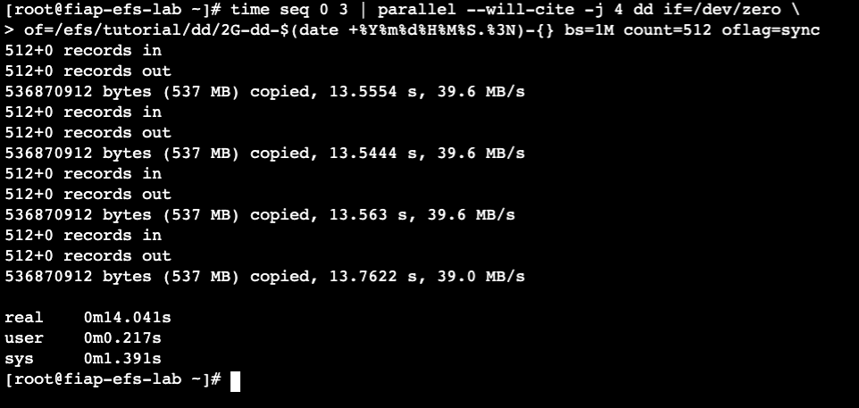

<details>
<summary>
<b>Explicação do comando de escrita de arquivo de 2GB com 4 threads</b>
</summary>
<blockquote>

### Comando Desmembrado

1. **`time seq 0 3`**:
   - **`time`**: Este comando mede o tempo necessário para a execução de outro comando.
   - **`seq 0 3`**: Gera uma sequência numérica de 0 a 3. O comando `seq` é usado para gerar uma série de números.

2. **`parallel --will-cite -j 4`**:
   - **`parallel`**: Ferramenta que permite executar comandos em paralelo. Isso significa que em vez de executar os comandos sequencialmente, eles são executados simultaneamente.
   - **`--will-cite`**: Não é um parâmetro padrão do `parallel`. Pode ser um erro de digitação ou um parâmetro personalizado não padrão. Normalmente, o `parallel` usa opções como `-j` para especificar o número de trabalhos a serem executados em paralelo.
   - **`-j 4`**: Especifica que quatro trabalhos devem ser executados em paralelo.

3. **`dd if=/dev/zero of=/efs/tutorial/dd/2G-dd-$(date +%Y%m%d%H%M%S.%3N)-{} bs=1M count=512 oflag=sync`**:
   - **`dd`**: Comando que copia e converte arquivos. Aqui, ele é usado para criar arquivos de 2 GB cada.
   - **`if=/dev/zero`**: Lê de `/dev/zero`, que é um dispositivo especial que fornece um fluxo infinito de zeros.
   - **`of=/efs/tutorial/dd/2G-dd-$(date +%Y%m%d%H%M%S.%3N)-{}`**: Especifica o nome do arquivo de saída. O nome inclui a data e hora atual (com precisão de milissegundos) e um número que será substituído pelo `parallel`.
   - **`bs=1M`**: Define o tamanho do bloco para 1 megabyte.
   - **`count=512`**: Especifica que 512 blocos devem ser escritos, resultando em um arquivo de 512 MB (não 2 GB como sugerido pelo nome do arquivo).
   - **`oflag=sync`**: Força a escrita síncrona, garantindo que os dados sejam gravados imediatamente no disco.

### Como Funciona

1. **Geração de Sequência e Execução Paralela**: O `seq 0 3` gera números de 0 a 3, que são usados pelo `parallel` para executar quatro instâncias do comando `dd` simultaneamente.

2. **Criação de Arquivos**: Cada instância do `dd` cria um arquivo de 512 MB no diretório `/efs/tutorial/dd/`. O nome do arquivo inclui a data e hora atual e um número que varia de 0 a 3.

3. **Impacto no Desempenho do EFS**:
   - **Escrita Paralela**: A escrita paralela pode aumentar a carga no EFS, especialmente se o sistema estiver configurado para lidar com um grande número de operações de E/S simultâneas.
   - **Tamanho dos Blocos e Sincronização**: O uso de blocos de 1 MB com `oflag=sync` garante que as operações de escrita sejam concluídas rapidamente, mas pode aumentar a sobrecarga devido à sincronização.
   - **Monitoramento e Limites**: O EFS tem limites de taxa de transferência e IOPS (operações de entrada/saída por segundo) que podem ser alcançados com operações intensivas como essa. Se esses limites forem ultrapassados, o desempenho pode ser afetado.

### Considerações de Desempenho

- **Monitoramento**: É crucial monitorar o desempenho do EFS durante operações intensivas para garantir que os limites de IOPS e taxa de transferência não sejam ultrapassados.
- **Otimização**: Ajustar o tamanho dos blocos e o número de trabalhos em paralelo pode ajudar a otimizar o desempenho com base nas especificações do sistema e nas necessidades da aplicação.
- **Configuração do EFS**: Verificar a configuração do EFS, como o tipo de sistema de arquivos e as opções de montagem, pode ajudar a melhorar o desempenho em operações de E/S intensivas.

</blockquote>
</details>

2. Agora vamos criar o mesmo arquivo de 2GB, mas com 16 threads. Execute o comando abaixo:

```bash
time seq 0 15 | parallel --will-cite -j 16 dd if=/dev/zero \
of=/efs/tutorial/dd/2G-dd-$(date +%Y%m%d%H%M%S.%3N)-{} bs=1M count=128 oflag=sync  
```
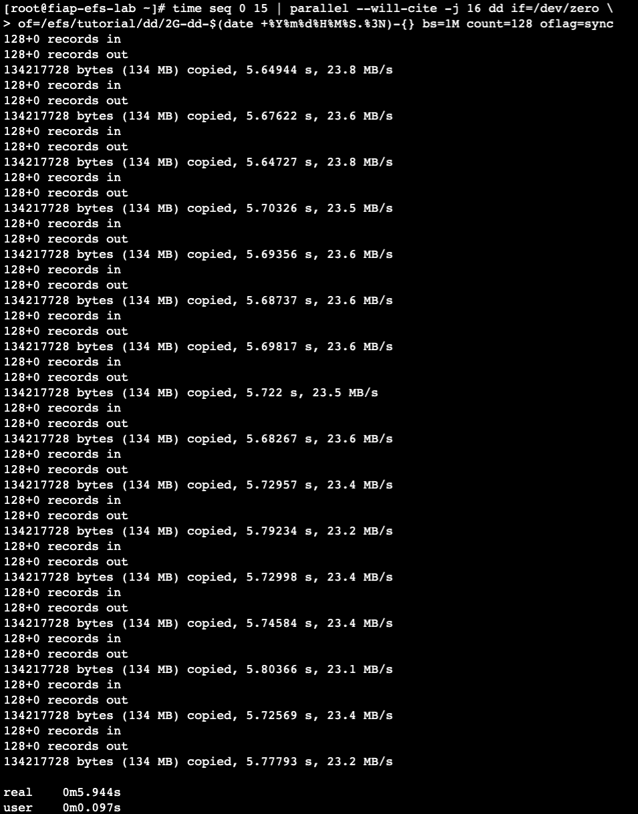

<details>
<summary>
<b>Explicação do comando de escrita de arquivo de 2GB com 16 threads</b>
</summary>
<blockquote>

### Comando Desmembrado

1. **`seq 0 15`**:
   - Gera uma sequência numérica de 0 a 15. Isso significa que o comando `parallel` irá executar 16 instâncias do comando `dd`.

2. **`parallel --will-cite -j 16`**:
   - **`-j 16`**: Especifica que 16 trabalhos devem ser executados em paralelo. Isso significa que 16 instâncias do comando `dd` serão executadas simultaneamente.

3. **`dd if=/dev/zero of=/efs/tutorial/dd/2G-dd-$(date +%Y%m%d%H%M%S.%3N)-{} bs=1M count=128 oflag=sync`**:
   - **`count=128`**: Cada arquivo gerado terá 128 blocos de 1 MB, resultando em arquivos de 128 MB cada.

### Como Funciona

1. **Execução Paralela Aumentada**: Com 16 instâncias do `dd` executadas simultaneamente, a carga no EFS aumenta significativamente em comparação com a execução de apenas 4 instâncias no comando anterior.

2. **Tamanho dos Arquivos**: Cada arquivo gerado tem 128 MB, o que é menor do que os 512 MB dos arquivos no comando anterior.

### Impacto no Desempenho do EFS

1. **Aumento da Carga de E/S**:
   - Executar 16 operações de escrita em paralelo aumenta a carga de E/S no EFS. Isso pode levar a um aumento na latência e no uso de recursos se o sistema não estiver configurado para lidar com essa carga.

2. **Limites de IOPS e Taxa de Transferência**:
   - O EFS tem limites de IOPS e taxa de transferência. Executar muitas operações em paralelo pode ultrapassar esses limites, especialmente se o sistema de arquivos estiver configurado para otimizar a capacidade de transferência em vez da latência.

3. **Otimização do Desempenho**:
   - Para otimizar o desempenho, é importante monitorar os limites de IOPS e taxa de transferência do EFS e ajustar o número de operações em paralelo com base nas especificações do sistema e nas necessidades da aplicação.

4. **Configuração do EFS**:
   - Ajustar a configuração do EFS, como o tipo de sistema de arquivos e as opções de montagem, pode ajudar a melhorar o desempenho em operações de E/S intensivas.

### Considerações Adicionais

- **Monitoramento Contínuo**: É crucial monitorar continuamente o desempenho do EFS durante operações intensivas para garantir que os limites não sejam ultrapassados e que o sistema esteja operando dentro dos parâmetros esperados.
- **Ajustes Dinâmicos**: Ajustar dinamicamente o número de trabalhos em paralelo ou o tamanho dos arquivos com base no desempenho real pode ajudar a otimizar a utilização dos recursos do EFS.

</blockquote>
</details>


### Conclusão Comparativa

Os dois comandos analisados são utilizados para realizar operações de escrita em disco no Amazon Elastic File System (EFS), mas apresentam diferenças significativas em termos de escala e configuração.

**Diferenças Principais:**

1. **Número de Instâncias Paralelas**:
   - O primeiro comando executa 4 instâncias do `dd` em paralelo, enquanto o segundo comando executa 16 instâncias. Isso significa que o segundo comando coloca uma carga muito maior no EFS.
   
2. **Tamanho dos Arquivos**:
   - O primeiro comando gera arquivos de 512 MB cada, enquanto o segundo comando gera arquivos de 128 MB. Isso pode afetar o desempenho em termos de IOPS e taxa de transferência.

3. **Impacto no Desempenho**:
   - O segundo comando, devido ao maior número de instâncias paralelas e ao menor tamanho dos arquivos, pode ser mais propenso a ultrapassar os limites de IOPS do EFS, especialmente em sistemas que não estão otimizados para alta carga de E/S.

**Quando Utilizar Cada Comando:**

1. **Comando com 4 Instâncias Paralelas**:
   - Ideal para testes de desempenho em ambientes menores ou quando se deseja uma carga moderada no EFS. É útil para avaliar o comportamento do sistema em condições de carga mais controladas.
   
2. **Comando com 16 Instâncias Paralelas**:
   - Apropriado para simular cargas extremas em ambientes de produção ou em testes de escalabilidade. É útil para avaliar a capacidade do EFS de lidar com operações intensivas e identificar possíveis gargalos.

Em resumo, o comando com menos instâncias paralelas é mais adequado para testes de desempenho em ambientes menores ou para simular cargas moderadas, enquanto o comando com mais instâncias é melhor para testes de escalabilidade e simulação de cargas extremas. A escolha depende das necessidades específicas do teste e da configuração do sistema.

## Parte 5 - Delete o ambiente

1. Devolta ao `Codespaces`, entre na pasta onde criou executou o terraform de criação do EFS e Ec2.

```bash
cd /workspaces/fiap-arquitetura-compute-e-storage/02-Storage/02-Network-file-system/efs-instance
```

2. Execute o comando abaixo para deletar o ambiente. Ao final do comando ficará como na imagem abaixo.

```bash
terraform destroy -auto-approve
```

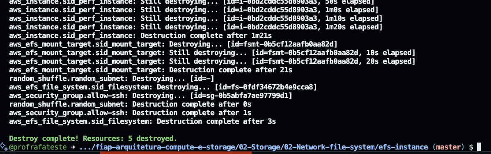

