# 03.1 - Compute X86 vs Graviton


**Antes de começar, execute os passos abaixo para configurar o ambiente caso não tenha feito isso ainda na aula de HOJE: [Preparando Credenciais](../../01-create-codespaces/Inicio-de-aula.md)**

### 🔍 Introdução ao Laboratório: Comparando Arquiteturas EC2 (x86 vs Graviton)

Neste laboratório prático, você irá explorar na prática as diferenças entre duas arquiteturas de instâncias EC2 amplamente utilizadas na AWS: **x86_64 (Intel/AMD)** e **Graviton (ARM64)**.

Você aprenderá a:

- Lançar instâncias EC2 com **Ubuntu 22.04** em ambas as arquiteturas.
- Instalar ferramentas de benchmark como `sysbench`, `gzip`, `Python` e `Node.js`.
- Executar testes de CPU, memória e compressão.
- Avaliar a performance de código real em **Python** e **Node.js**.
- Identificar vantagens e limitações de cada arquitetura.

Esses testes ajudam a entender conceitos como **eficiência computacional**, **consumo de CPU**, **latência**, e também permitem observar diferenças de **custo-benefício** entre as opções — algo essencial para decisões de arquitetura em nuvem.

> ⚠️ Este laboratório é compatível com o ambiente da [AWS Academy Learner Lab](https://awsacademy.instructure.com/), respeitando as limitações de instância, região e permissões.

## 📚 Recursos úteis:

- 🔗 [Documentação oficial EC2 Graviton](https://docs.aws.amazon.com/ec2/latest/userguide/graviton.html)  
- 🔗 [Diferenças entre arquiteturas ARM e x86](https://aws.amazon.com/ec2/graviton/)  
- 🔗 [Sysbench no GitHub](https://github.com/akopytov/sysbench)  
- 🔗 [Comparação de instâncias EC2](https://instances.vantage.sh/)

---

> Ao final, você será capaz de tomar decisões mais informadas sobre o uso de instâncias EC2 com base no perfil de workload, performance e custo.

1. Dentro do codespace, acesse o diretório onde esta o terraform que irá disponibilizar o ambiente para o laboratório:

```bash
cd /workspaces/fiap-arquitetura-compute-e-storage/03-Compute/01-X86-Graviton/terraform
```

2. Altere o arquivo `state.tf` e altere o bucket de acordo com o seu bucket criado no setup `base-config-SEU-RM`. Para tal, execute dos comandos abaixo:

```bash
export bucket=$(aws s3 ls | awk '/base-config-/ {print $3; exit}')
sed -i "s/base-config-SEU_RM/$bucket/g" state.tf
```

3. Inicialize o terraform:

```bash
terraform init
```

4. Aplique o terraform:

```bash
terraform apply -auto-approve
```

Esse terraform irá criar um ambiente com duas instâncias EC2, uma com arquitetura x86 e outra com arquitetura Graviton.

5. Acesse o [console da AWS](https://us-east-1.console.aws.amazon.com/ec2/home?region=us-east-1#Instances:v=3;$case=tags:true%5C,client:false;$regex=tags:false%5C,client:false;sort=instanceState) e verifique o status das instâncias criadas. Aguarde até que ambas estejam em `running` e com status `3/3 verificações aprovadas` como na imagem abaixo:

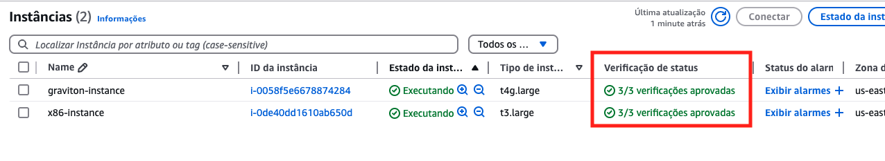

6. Para acessar as instancias você vai utilizar o ssm. Para tal, selecione as duas instâncias. E clique em `Conectar`. Isso vai abrir 2 abas, uma para cada instância. Clique em `Conectar` novamente.

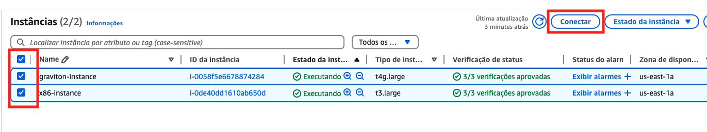


7. Se o passo anterior foi executado corretamente, você terá 2 abas abertas de terminal no seu navegador, uma para cada instância. Repare nos nomes das abas, uma é `x86` e a outra é `graviton`.

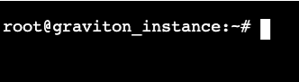

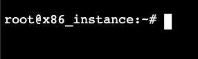


> ⚠️ Daqui em diante você vai **executar os comandos em ambos os terminais(x86 e graviton).**

8. Execute o comando abaixo para instalar as dependências necessárias em ambas as maquinas(x86 e graviton). Caso queira ver o script é o [install.sh](terraform/install.sh) que esta na pasta terraform.:

```bash
curl -Ssl https://raw.githubusercontent.com/vamperst/fiap-arquitetura-compute-e-storage/refs/heads/master/03-Compute/01-X86-Graviton/terraform/install.sh | bash
```

> 💡 **Dica rápida:**  
> Para manter o terminal organizado durante os testes, pressione `Ctrl + L` para **limpar a tela**.  
> Isso funciona como o comando `clear` e ajuda a focar apenas na saída do próximo comando.

9. Vamos inicialmente testar ambos os processadores com o `sysbench`. Execute o comando abaixo em ambos os terminais:

```bash
sysbench cpu --cpu-max-prime=20000 --time=10 run
```

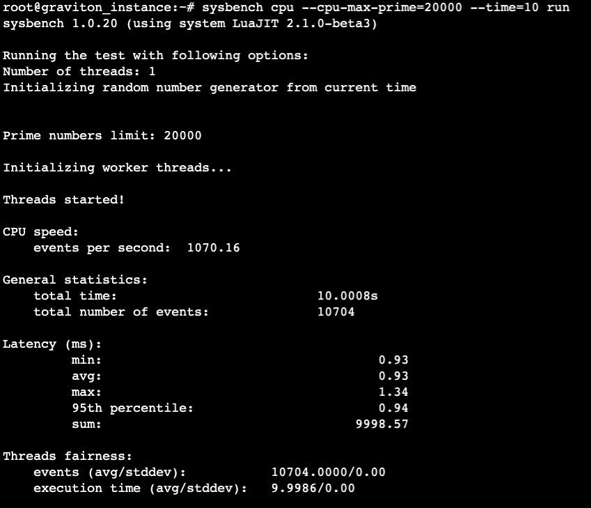

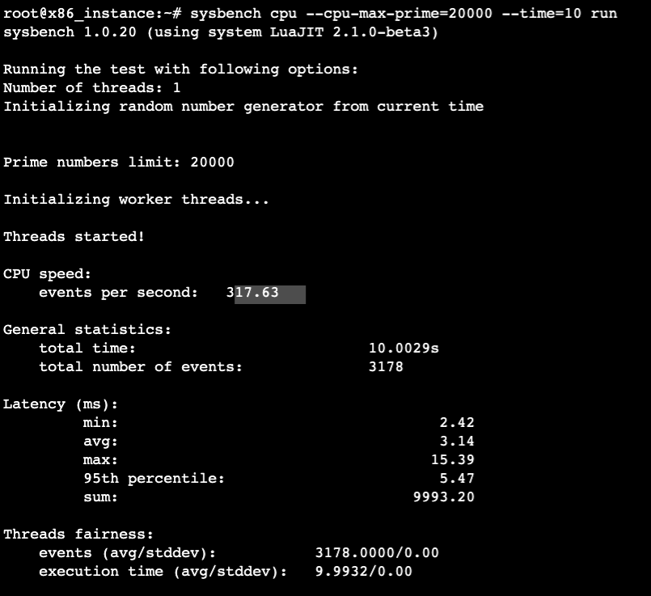

<details>
<summary>   
<b>Explicação do comando sysbench com uma thread</b>
</summary>
<blockquote>

## 🧠 **O que é o `sysbench`?**

O `sysbench` é uma ferramenta de benchmarking modular usada para avaliar o desempenho de:
- CPU
- Memória
- I/O (entrada/saída)
- Threads
- Banco de dados (MySQL, etc.)

No nosso caso, estamos usando o módulo **`cpu`**, que foca apenas no poder de processamento da CPU.

---

## 🔍 **Explicação do comando por partes:**

### `sysbench cpu`
Seleciona o **teste de CPU** (módulo que executa cálculos matemáticos intensivos, como números primos).

---

### `--cpu-max-prime=20000`
Define o **limite até onde o `sysbench` vai calcular números primos**.

- Nesse caso, ele calcula **todos os números primos até 20.000**.
- Esse cálculo é feito repetidamente dentro do tempo especificado (`--time=10`).
- A complexidade do cálculo cresce linearmente com esse valor. Se você aumentar esse número, o teste será mais pesado.

📌 **Por que primos?**
- Calcular números primos exige operações matemáticas intensivas e repetitivas.
- Isso força a CPU a **trabalhar com cálculos reais**, sem depender de disco, rede ou RAM, focando apenas no processamento puro.

---

### `--time=10`
Define que o teste deve rodar por **10 segundos**.

- Durante esse tempo, o `sysbench` executa o cálculo de primos continuamente.
- O resultado será o número de vezes que ele conseguiu executar o cálculo dentro do tempo.

---

### `run`
Executa o teste com os parâmetros definidos.

---

## 📊 **O que o teste mede?**

Após rodar, o `sysbench` exibe várias métricas importantes:

| Métrica                  | Significado                                                                 |
|--------------------------|------------------------------------------------------------------------------|
| `events per second`      | Quantos cálculos completos foram feitos por segundo (indicador de performance). |
| `total number of events` | Quantas vezes o teste foi completado em 10s.                                 |
| `avg latency`            | Tempo médio (em ms) para completar um cálculo.                              |
| `min/max latency`        | Melhor e pior tempo de resposta de um cálculo individual.                   |

---

## 💥 **Impacto no desempenho da CPU**

Esse teste:

- **Utiliza apenas 1 thread** por padrão → ele mede o desempenho de **um único núcleo da CPU**.
- Ajuda a avaliar **eficiência da arquitetura** (instruções por ciclo, desempenho por watt, etc.).
- Ideal para comparar instâncias com arquiteturas diferentes (ex: Graviton vs Intel).
- Pode **mostrar gargalos** ou instâncias subdimensionadas para cargas de trabalho com uso intenso de CPU.

---


## ✅ **Resumo**

O comando `sysbench cpu --cpu-max-prime=20000 --time=10 run`:

- Calcula números primos até 20.000 repetidamente por 10 segundos.
- Mede o desempenho **puro da CPU** (sem interferência de disco ou memória).
- Mostra quantos cálculos são feitos por segundo e quanto tempo cada um leva.
- É ideal para **comparar performance entre diferentes tipos de instância ou arquitetura.**

</blockquote>
</details>

Esse comando mede quantos eventos (cálculos de primos) por segundo a CPU consegue realizar, além de dados como latência média e total de eventos processados.

---

## ⚙️ Resultado em Instância x86 (`t3.large`)

CPU speed:  
events per second: 317.63  
total number of events: 3178  
avg latency: 3.14 ms

---

## ⚙️ Resultado em Instância Graviton (`t4g.large`)

CPU speed:  
events per second: 1070.16  
total number of events: 10704  
avg latency: 0.93 ms

---

## 📊 Análise dos Resultados

| Métrica                  | x86 (t3.large) | Graviton (t4g.large) | Diferença aproximada    |
|--------------------------|----------------|------------------------|--------------------------|
| Eventos por segundo      | 317.63         | 1070.16                | 🔺 ~3.4x mais rápido      |
| Total de eventos         | 3178           | 10704                  | 🔺 ~3.4x mais eventos     |
| Latência média (ms)      | 3.14           | 0.93                   | 🔻 Menor no Graviton      |

A instância Graviton apresentou desempenho **mais de 3 vezes superior** no cálculo de números primos com uma única thread. Isso destaca a **eficiência da arquitetura ARM** para operações matemáticas e workloads computacionais intensivos.

---

## 🧠 Considerações

- Resultados podem variar de acordo com a carga da máquina ou momento do teste.
- Graviton é projetado para oferecer **melhor desempenho por watt**, sendo ideal para ambientes escaláveis e econômicos.
- Algumas aplicações que dependem de bibliotecas nativas x86 podem exigir ajustes para rodar em ARM, mas linguagens como Python, Node.js e Java funcionam normalmente.

10. Agora vamos testar com 2 threads já que ambas as maquinas tem 2 vCPUs. Execute o comando abaixo em ambos os terminais:

```bash
sysbench cpu --cpu-max-prime=30000 --time=40 --threads=2 run
```

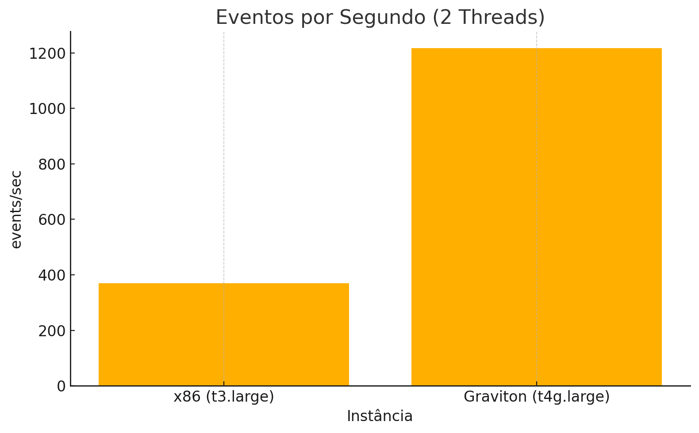


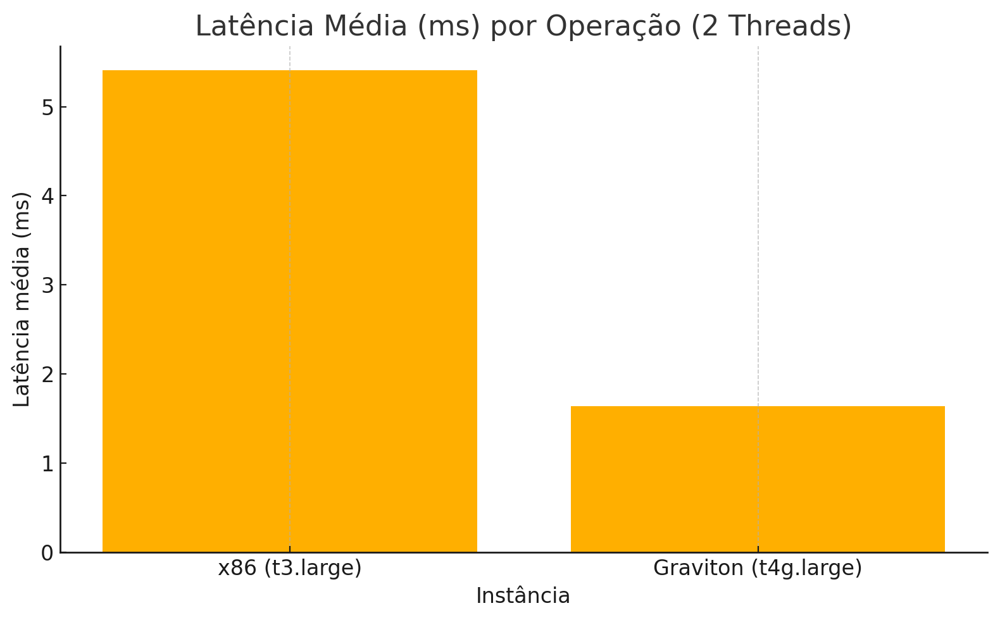

### 📊 Análise do Teste com 2 Threads (sysbench)

Este novo teste utilizou dois threads para estressar os dois vCPUs disponíveis em cada instância. O objetivo foi observar como cada arquitetura se comporta quando usamos **paralelismo**, ou seja, ambos os núcleos da instância operando ao mesmo tempo com uma carga intensa.

---

### ✅ Principais Resultados:

| Métrica                    | x86 (t3.large) | Graviton (t4g.large) |
|---------------------------|----------------|-----------------------|
| **Eventos por segundo**   | 369.42         | 1217.08              |
| **Total de eventos (40s)**| 14.779         | 48.687               |
| **Latência média (ms)**   | 5.41           | 1.64                 |

---

### 📈 Interpretação dos Gráficos:

1. **Eventos por Segundo:**  
   O Graviton apresentou uma taxa de eventos por segundo mais de **3 vezes maior** que o x86. Isso mostra que ele consegue processar mais operações computacionais em menos tempo, mesmo sob carga paralela.

2. **Total de Eventos:**  
   Em 40 segundos, a instância Graviton executou **48.687 eventos**, contra apenas **14.779** da x86. Isso confirma a superioridade da arquitetura ARM na execução simultânea de múltiplos cálculos.

3. **Latência Média:**  
   A latência por operação no Graviton foi de apenas **1.64 ms**, contra **5.41 ms** na x86 — uma diferença de **quase 70% a menos**, indicando maior responsividade e menor custo por operação.

---

### 🧠 Conclusão:

O teste com dois threads deixa ainda mais evidente a vantagem da arquitetura Graviton (ARM64) sobre a x86 (Intel/AMD) para workloads **CPU-bound com múltiplos núcleos**.


11. O teste seguinte é sobre a memória. Execute o comando abaixo em ambos os terminais(x86 e graviton):

```bash
sysbench memory --memory-block-size=1M --memory-total-size=10G run
```

<details>
<summary>
<b>Explicação do comando sysbench para teste de memória</b>
</summary>
<blockquote>

## 💾 Teste de Desempenho de Memória com Sysbench

Para avaliar a velocidade de leitura/escrita da memória RAM da instância, utilizamos o seguinte comando:

``` bash
sysbench memory --memory-block-size=1M --memory-total-size=10G run
```

### 🔍 O que este comando faz:

Este teste mede a taxa de transferência de memória (memory throughput), ou seja, **quão rápido a instância consegue movimentar dados na RAM**.

- `--memory-block-size=1M`: Cada operação manipula blocos de 1 megabyte.
- `--memory-total-size=10G`: O teste executa operações até atingir um total de 10 gigabytes de dados processados.

O `sysbench` realiza **leituras e escritas sequenciais** na memória, sem envolver disco, CPU pesada ou rede. O resultado inclui a **velocidade média de transferência em MB/s** e as métricas de latência de acesso.

### 🧪 Quando usar:

Este comando é útil para:
- Comparar a performance de memória entre instâncias de diferentes arquiteturas (ex: Graviton vs x86).
- Avaliar a consistência do throughput de memória sob carga.
- Identificar gargalos em workloads com uso intensivo de RAM (ex: caches, bancos em memória, análises).

</blockquote>
</details>

---

Este comando mede a velocidade de escrita na memória RAM, utilizando blocos de 1 MB até atingir um total de 10 GB de dados. O teste foi executado com **apenas 1 thread**, para comparar a performance de acesso sequencial à memória em diferentes arquiteturas.

---

### ⚙️ Resultado - Instância x86 (`t3.large`)

- **Velocidade de escrita**: `14021.56 MiB/sec`
- **Tempo total do teste**: `0.7286 s`
- **Latência média**: `0.07 ms`
- **Total de operações**: `10240`

---

### ⚙️ Resultado - Instância Graviton (`t4g.large`)

- **Velocidade de escrita**: `12637.23 MiB/sec`
- **Tempo total do teste**: `0.8088 s`
- **Latência média**: `0.08 ms`
- **Total de operações**: `10240`

---

## 📊 Análise Comparativa

| Métrica                | x86 (t3.large) | Graviton (t4g.large) | Diferença                  |
|------------------------|----------------|------------------------|-----------------------------|
| Velocidade (MiB/sec)   | 14021.56       | 12637.23               | 🔺 x86 ~10% mais rápido      |
| Latência média (ms)    | 0.07           | 0.08                   | 🔻 Graviton levemente maior |
| Tempo total (s)        | 0.7286         | 0.8088                 | 🔺 x86 completou mais rápido |

---

## 🧠 Interpretação

Neste teste, a instância **x86 (t3.large)** demonstrou desempenho de memória levemente superior em comparação à **Graviton (t4g.large)**. A taxa de transferência ficou cerca de **10% mais alta** na x86, e o tempo total de execução foi menor.

No entanto, ambos os resultados são **excelentes** e mostram que as duas arquiteturas oferecem **alto desempenho de acesso à memória** em operações sequenciais. A diferença observada pode estar relacionada à forma como cada arquitetura lida com buffer/cache ou instruções SIMD otimizadas para memória.

Este teste é especialmente útil para workloads que envolvem **manipulação de grandes volumes de dados em memória**, como caches, bancos de dados in-memory ou processamento de arquivos.

---

## 🔍 Observação

Resultados podem variar levemente entre execuções. Para uma medição mais precisa, recomenda-se:
- Repetir o teste algumas vezes e calcular a média.
- Testar com múltiplos threads (`--threads=2`, por exemplo).
- Monitorar métricas do sistema com `htop` ou `top` durante o teste.


12. O próximo teste é sobre compressão. Execute o comando abaixo em ambos os terminais(x86 e graviton):

```bash
mkdir -p teste-arquivo && cd teste-arquivo
dd if=/dev/urandom of=testfile.bin bs=1M count=1024
time gzip testfile.bin
```
<details>
<summary>
<b>Explicação do comando para teste de compressão</b>
</summary>
<blockquote>

O comando fornecido realiza duas operações distintas: criação de um arquivo com dados aleatórios e compressão desse arquivo usando o Gzip. Vamos detalhar cada etapa:

### 1. Criação do arquivo com `dd`
```bash
dd if=/dev/urandom of=testfile.bin bs=1M count=1024
```
- **`if=/dev/urandom`**: Define como origem o dispositivo especial `/dev/urandom`, que gera dados aleatórios.
- **`of=testfile.bin`**: Define o destino como o arquivo `testfile.bin`, onde os dados aleatórios serão gravados.
- **`bs=1M`**: Especifica o tamanho do bloco de dados a ser transferido como 1 megabyte.
- **`count=1024`**: Define que 1024 blocos de 1 MB serão escritos, resultando em um arquivo de aproximadamente 1 GB.

Essa etapa cria um arquivo grande preenchido com dados aleatórios. O uso de `/dev/urandom` garante que os dados sejam imprevisíveis, tornando o arquivo adequado para testes de desempenho ou segurança.

### 2. Compressão do arquivo com Gzip
```bash
time gzip testfile.bin
```
- **`gzip testfile.bin`**: Compacta o arquivo gerado (`testfile.bin`) utilizando o algoritmo Gzip, que combina LZ77 e codificação Huffman para reduzir redundâncias nos dados.
- **`time`**: Mede o tempo necessário para executar a compressão.

### Impacto no desempenho do CPU
- **Etapa `dd`:** A criação do arquivo consome recursos do CPU devido à geração de números aleatórios por `/dev/urandom`. Esse processo pode ser intensivo em sistemas com CPUs menos robustos.
- **Etapa `gzip`:** A compressão utiliza recursos significativos do CPU para aplicar os algoritmos LZ77 e Huffman. Como os dados são aleatórios, a compressão será menos eficiente (menor redução no tamanho do arquivo), pois não há padrões repetitivos para explorar.

### Resumo
Este comando é útil para testar o desempenho do sistema em operações intensivas de E/S (entrada e saída) e compressão. Ele avalia:
1. A capacidade do sistema de gerar grandes volumes de dados aleatórios.
2. A eficiência do CPU na compressão de arquivos grandes.

</blockquote>
</details>

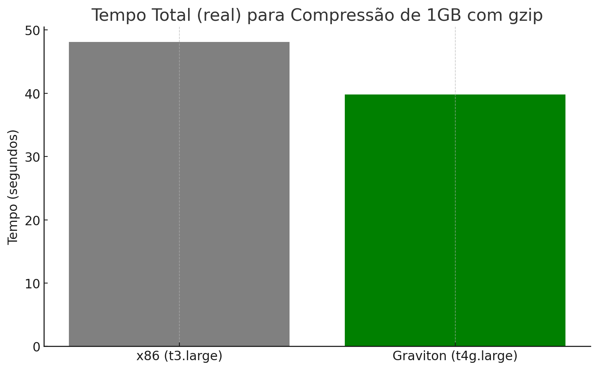

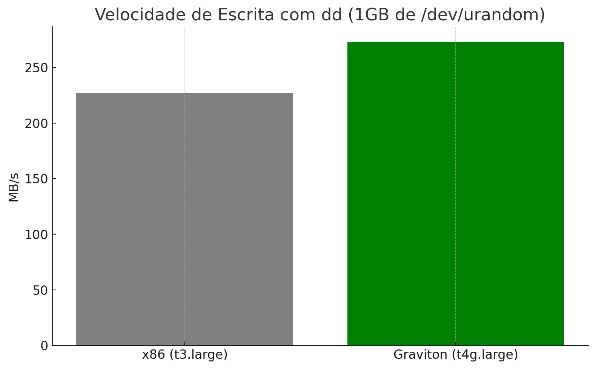

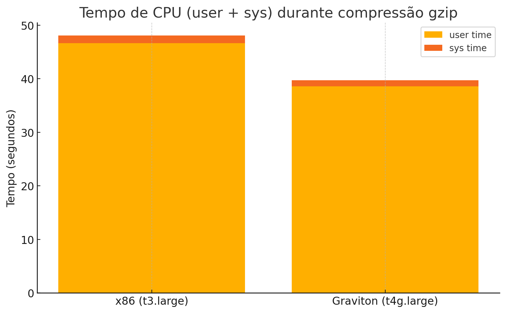

---

## 📊 Comparativo de Desempenho

### ⏱️ **Tempo total de compressão (`real`)**

- **x86 (t3.large):** 48.13 segundos  
- **Graviton (t4g.large):** 39.79 segundos

> 🔺 Graviton foi ~17% mais rápido na compressão do mesmo arquivo.

---

### ⚙️ **Velocidade de escrita com `dd` (criação do arquivo)**

- **x86:** 227 MB/s  
- **Graviton:** 273 MB/s

> Graviton teve **maior throughput de escrita**, o que pode indicar melhor acesso à RAM e/ou I/O otimizado.

---

### 🧠 **Uso de CPU (`user` + `sys`)**

- **x86:** 46.64s (user) + 1.46s (sys)
- **Graviton:** 38.58s (user) + 1.15s (sys)

> A instância Graviton foi mais eficiente tanto no processamento do usuário quanto no uso do sistema (syscalls, compressão interna).

---

## ✅ Conclusão

- Graviton foi mais rápido, consumiu menos tempo de CPU e apresentou melhor throughput na escrita de dados aleatórios.
- Isso mostra que a arquitetura ARM tem **vantagens reais em tarefas de compressão e manipulação de arquivos**, mesmo com workloads que utilizam uma única thread.
- Para workloads com uso intensivo de CPU e compressão, **Graviton pode oferecer desempenho superior com menor custo**.


13. O próximo teste é sobre Python. Execute o comando abaixo em ambos os terminais(x86 e graviton):

```bash
echo "🐍 Teste com Python - cálculo de Fibonacci"
cat << 'EOF' > cpustress.py
import time

def fib(n):
    if n <= 1:
        return n
    else:
        return fib(n-1) + fib(n-2)

start = time.time()
print(f"Fibonacci(40): {fib(40)}")
print(f"Execution Time: {time.time() - start} seconds")
EOF

python3 cpustress.py
```


# 🧠 Comparativo de Desempenho: Cálculo de Fibonacci em Python (x86 vs Graviton)

Este teste executa um algoritmo recursivo para calcular `Fibonacci(40)`, uma operação computacionalmente intensiva que força a CPU com chamadas de função repetitivas. O objetivo é comparar a eficiência das arquiteturas **x86 (t3.large)** e **Graviton (t4g.large)** usando código puro em Python.

## 🔢 Código executado

```python
import time

def fib(n):
    if n <= 1:
        return n
    else:
        return fib(n-1) + fib(n-2)

start = time.time()
print(f"Fibonacci(40): {fib(40)}")
print(f"Execution Time: {time.time() - start} seconds")
```

---

## ⏱️ Resultados

| Arquitetura       | Tempo de Execução |
|-------------------|-------------------|
| x86 (t3.large)    | **37.94 s**       |
| Graviton (t4g.large) | **41.03 s**    |

---

## 📊 Análise

- A instância **x86** executou o código aproximadamente **3 segundos mais rápido** que a Graviton.
- Embora o Graviton seja geralmente mais eficiente em tarefas multithread e workloads otimizados, esse resultado mostra que:
  - Para **scripts Python interpretados e com muita recursão**, o x86 ainda pode ter **vantagem leve**, especialmente com interpretadores otimizados para essa arquitetura.
- Essa diferença pode ser influenciada por:
  - Implementação do interpretador Python (CPython).
  - Otimizações em nível de instrução específicas da arquitetura.
  - Características da chamada de função recursiva em ambientes ARM.

---

## ✅ Conclusão

Ambas as instâncias completaram a tarefa com sucesso, mas o x86 apresentou uma leve vantagem em **execução recursiva pesada com Python**.

Para workloads computacionais mais complexos, vale a pena considerar:
- Testes com versões otimizadas de Python (como PyPy).
- Testes com múltiplas threads ou uso de NumPy.
- O custo-benefício da instância no cenário real.

> ℹ️ Graviton ainda tende a ser mais eficiente em termos de custo por hora, mesmo com desempenho levemente inferior nesse caso específico.

14. O último teste é sobre Node.js. Execute o comando abaixo em ambos os terminais(x86 e graviton):

```bash
echo "🟦 Teste com Node.js - hash SHA256"
cat << 'EOF' > hash.js
const crypto = require('crypto');

console.time('hash');
for (let i = 0; i < 1e7; i++) {
  crypto.createHash('sha256').update('AWS Academy').digest('hex');
}
console.timeEnd('hash');
EOF

node hash.js
```

# 🔐 Comparativo de Desempenho: Criptografia SHA256 com Node.js (x86 vs Graviton)

Neste teste, utilizamos um código em **Node.js** para calcular o hash **SHA256** da string `"AWS Academy"` dez milhões de vezes (`1e7`). O objetivo é comparar a performance entre duas arquiteturas de instância EC2: **x86 (t3.large)** e **Graviton (t4g.large)**.


---

## ⏱️ Resultados

| Arquitetura       | Tempo de Execução |
|-------------------|-------------------|
| x86 (t3.large)    | **28.589 s**      |
| Graviton (t4g.large) | **29.127 s**   |

---

## 📊 Análise

- A diferença de tempo foi **pequena (menos de 2%)**, com **x86 levemente mais rápido** neste cenário específico.
- O teste é intensivo em **CPU e operações de hash**, com grande número de iterações, mas **não multithread**.
- A diferença sutil pode estar relacionada a:
  - Otimizações do **Node.js nativo** para x86.
  - Overhead do runtime em ARM (mesmo que pequeno).
  - Uso de bibliotecas criptográficas subjacentes otimizadas para diferentes arquiteturas.

---

## ✅ Conclusão

Tanto o x86 quanto o Graviton apresentaram desempenho muito próximo ao processar operações criptográficas em Node.js. A diferença é praticamente **irrelevante em termos práticos**, o que mostra que workloads de hashing **são bem suportados em ambas as arquiteturas**.

> 💡 Para workloads escaláveis ou em larga escala, o **Graviton pode ainda ser mais vantajoso** devido ao seu custo-benefício em relação à performance por dólar.

15. De volta ao terminal do **Codespaces** execute o comando abaixo para finalizar o laboratório deletando as instâncias criadas:

```bash
cd /workspaces/fiap-arquitetura-compute-e-storage/03-Compute/01-X86-Graviton/terraform
terraform destroy -auto-approve
```