# 03.2 - Lab ECS + Fargate

## Introdução ao Lab: ECS + Fargate

Neste exercício, vamos aprender como executar uma aplicação em contêiner utilizando o **Amazon ECS (Elastic Container Service)** com a tecnologia **Fargate**, que permite rodar containers sem precisar gerenciar servidores ou clusters.

A ideia é simular um ciclo completo de deploy moderno em cloud, passando por três fases principais:

### 🔧 Parte 1 – Infraestrutura como Código (IaC)
Nesta etapa, utilizamos o **Terraform** para provisionar toda a infraestrutura necessária, como:
- Repositório de container (ECR)
- Cluster ECS com Fargate
- Rede, subnets e segurança básica

### 📦 Parte 2 – Build e Deploy da Aplicação
Aqui você:
- Faz login no **ECR**
- **Builda** a imagem da aplicação com Docker
- **Publica** essa imagem no repositório
- Valida o deploy automático da imagem no ECS

### 🔍 Parte 3 – Validação e Acesso
Você vai:
- Verificar no console AWS se os recursos foram criados corretamente
- Acessar a aplicação via IP público
- Testar a resposta da aplicação tanto no navegador quanto via `curl` (para contornar possíveis restrições de rede)

Ao final do exercício, destruiremos todo o ambiente provisionado, reforçando boas práticas de uso de recursos em nuvem.


## Parte 1 - Monte o ambiente

1. No codespaces execute o comando abaixo para entrar na pasta correta do terraform que vai provisionar o lab:

```bash
cd /workspaces/fiap-arquitetura-compute-e-storage/03-Compute/02-ECS-Fargate/terraform
```

2. Execute o comando abaixo para copiar o nome do bucket que será utilizado para armazenar o estado do terraform:

```bash
export bucket=$(aws s3 ls | awk '/base-config-/ {print $3; exit}')
sed -i "s/base-config-SEU_RM/$bucket/g" state.tf
```
3. Execute o comando abaixo para inicializar o terraform:

```bash
terraform init
```

4. Execute o comando abaixo para aplicar o plano do terraform:

```bash
terraform plan -out out.plan
terraform apply out.plan
```

<details>
<summary>   
<b>Explicação do terraform</b>
</summary>
<blockquote>

### 🔍 `data "aws_caller_identity" "current" {}`
- Obtém informações da **conta AWS atual**, como:
  - ID da conta (`account_id`)
  - ID do usuário
  - ARN
- Essa informação é usada mais abaixo para montar o ARN da role `LabRole`.

---

### 📦 `resource "aws_ecs_cluster" "lab_cluster" { ... }`
- Cria um **ECS Cluster** com o nome `ecs-fargate-lab-cluster`.
- É o “ambiente” onde suas tasks ECS (containers) vão rodar.

---

### 🗃️ `resource "aws_ecr_repository" "app" { ... }`
- Cria um **ECR (Elastic Container Registry)** com o nome `ecs-fargate-lab`.
- Esse repositório será usado para armazenar a imagem Docker da aplicação que será executada no ECS.

---

### ⚙️ `resource "aws_ecs_task_definition" "app" { ... }`
- Cria uma **task definition**, que é como a “receita” de como a aplicação containerizada deve rodar.
- Vamos aos detalhes dessa configuração:

| Campo                      | Significado |
|---------------------------|-------------|
| `family`                  | Nome lógico da task definition (`ecs-fargate-lab-task`). |
| `network_mode = "awsvpc"` | Permite a task ter IP próprio e controle direto de rede (obrigatório no Fargate). |
| `requires_compatibilities = ["FARGATE"]` | Informa que esta task será executada em **Fargate** (sem EC2). |
| `cpu = "256"`             | Aloca 0.25 vCPU para a task. |
| `memory = "512"`          | Aloca 512 MB de RAM para a task. |
| `execution_role_arn`     | ARN da role (`LabRole`) que permite o ECS fazer *pull* da imagem no ECR. |
| `container_definitions`  | Define o container: nome, imagem e a porta exposta (`3000`). |

> Importante: o container será criado a partir da imagem `latest` que foi enviada para o ECR.

---

### 🚀 `resource "aws_ecs_service" "app_service" { ... }`
- Cria um **serviço ECS**, que é responsável por:
  - **Lançar** e **manter** a task rodando no cluster.
  - **Recriar** a task automaticamente se ela falhar.

| Campo                      | Significado |
|---------------------------|-------------|
| `name`                    | Nome do serviço: `ecs-fargate-app-service`. |
| `cluster`                 | Informa o ECS Cluster onde a task deve ser executada. |
| `task_definition`         | Qual task definition será usada para rodar o container. |
| `desired_count = 1`       | Garante que sempre exista **1 instância** da task rodando. |
| `launch_type = "FARGATE"` | Indica que a task será executada usando Fargate. |

#### 📡 `network_configuration` (dentro do serviço)
| Campo                      | Significado |
|---------------------------|-------------|
| `subnets`                 | Informa em qual **subnet** a task será lançada (neste caso, vem de um `random_shuffle`). |
| `security_groups`         | Define o **security group** que controla as regras de entrada e saída da task. |
| `assign_public_ip = true` | Atribui um **IP público** à task, permitindo acesso externo (ex: via navegador). |

</blockquote>
</details>

## Componentes do Amazon ECS (Elastic Container Service)

O Amazon ECS é um serviço gerenciado da AWS que facilita a execução e o gerenciamento de aplicações em contêineres. Ele é composto por diversos componentes que trabalham juntos para oferecer um ambiente escalável, flexível e seguro. Abaixo, explico cada componente detalhadamente:

---

### **1. Cluster**
- Um **cluster** é um agrupamento lógico de recursos onde as tarefas e serviços são executados.
- Pode conter instâncias do EC2, servidores on-premises ou usar o AWS Fargate (opção sem servidor).
- É o ponto central que conecta a capacidade computacional às tarefas e serviços.

---

### **2. Definição de Tarefa**
- A **definição de tarefa** é como um "modelo" que descreve como os contêineres serão executados.
- Inclui informações como:
  - Imagens de contêineres (geralmente armazenadas no Amazon ECR ou outro registro).
  - Configurações de CPU, memória e volumes.
  - Portas expostas e variáveis de ambiente.
- Especificada em um arquivo JSON.

---

### **3. Tarefa**
- Uma **tarefa** é uma instância em execução de uma definição de tarefa.
- Pode ser executada de forma independente ou como parte de um serviço.
- É a unidade básica de execução dentro do ECS.

---

### **4. Serviço**
- Um **serviço** gerencia a execução contínua de tarefas em um cluster.
- Garante que o número desejado de tarefas esteja sempre em execução.
- Oferece suporte a balanceamento de carga, escalabilidade automática e alta disponibilidade.

---

### **5. Agente de Contêiner**
- O **agente de contêiner** é executado em cada instância do EC2 no cluster.
- Ele comunica o estado das tarefas para o ECS e executa comandos recebidos, como iniciar ou parar tarefas.

---

### **6. Tipos de Inicialização**
O ECS suporta diferentes tipos de inicialização para executar os contêineres:
1. **Amazon EC2**:
   - Usa instâncias EC2 para hospedar os contêineres.
   - Oferece controle total sobre a infraestrutura.
2. **AWS Fargate**:
   - Opção sem servidor, onde você não precisa gerenciar instâncias.
   - Paga apenas pelos recursos utilizados pelos contêineres.
3. **ECS Anywhere**:
   - Permite registrar servidores on-premises ou máquinas virtuais externas no cluster.

---

### **7. Balanceador de Carga**
- O ECS pode integrar-se ao Elastic Load Balancer (ELB) para distribuir tráfego entre as tarefas.
- Suporta balanceadores do tipo Application Load Balancer (ALB) e Network Load Balancer (NLB).

---

### **8. Registro de Imagens**
- As imagens dos contêineres são armazenadas em registros como o Amazon Elastic Container Registry (ECR) ou outros registros compatíveis com Docker.

---

### **9. Redes e Sub-redes**
- As tarefas podem ser configuradas para usar sub-redes públicas ou privadas dentro de uma VPC (Virtual Private Cloud).
  - Sub-redes públicas: conectadas à Internet via gateway da Internet.
  - Sub-redes privadas: conectadas via gateway NAT para maior segurança.

---

### **10. Service Connect**
- Facilita a comunicação entre serviços no mesmo cluster usando nomes DNS amigáveis.
- Configura proxies locais para balancear cargas entre serviços cliente-servidor.

---

### Fluxo Geral do ECS
1. Crie um **cluster** para agrupar os recursos computacionais.
2. Defina uma **definição de tarefa** com as configurações dos contêineres.
3. Inicie uma ou mais **tarefas**, diretamente ou por meio de um **serviço**.
4. Use balanceadores de carga para distribuir tráfego entre as tarefas, se necessário.
5. Monitore e gerencie as tarefas usando o console do ECS, CLI ou APIs da AWS.

O Amazon ECS é altamente integrado com outros serviços da AWS, como IAM (para controle de acesso), CloudWatch (para monitoramento), e Auto Scaling (para escalabilidade). Essa integração facilita a criação e gerenciamento eficiente de aplicações baseadas em contêineres na nuvem da AWS!


## Parte 2 - Subir o código da aplicação para o ECR

5. Chegou a hora de montar a aplicação e primeiro entre na pasta onde esta o código. Execute os comandos abaixo:

```bash
cd /workspaces/fiap-arquitetura-compute-e-storage/03-Compute/02-ECS-Fargate/app
```
6. Execute o comando abaixo para fazer o login no ECR:

```bash
ECR_REPO_URL=$(aws ecr describe-repositories --repository-name ecs-fargate-lab | jq .repositories[0].repositoryUri -r)
aws ecr get-login-password | docker login --username AWS --password-stdin $ECR_REPO_URL
```

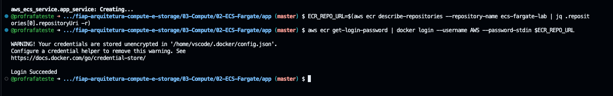

7. Execute o comando abaixo para construir a imagem da aplicação:

```bash
docker build -t ecs-fargate-lab .
```

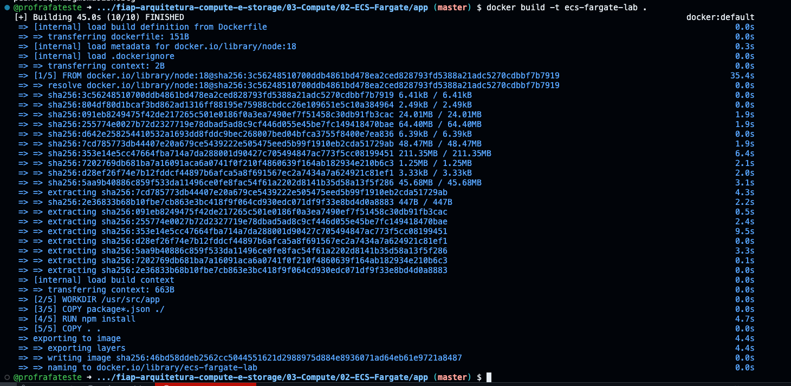

8. Execute o comando abaixo para taggear a imagem:

```bash
docker tag ecs-fargate-lab:latest $ECR_REPO_URL:latest
```

9. Execute o comando abaixo para enviar a imagem para o ECR:

```bash
docker push $ECR_REPO_URL:latest
```


11. Vá até o console do [ECR](https://us-east-1.console.aws.amazon.com/ecr/private-registry/repositories?region=us-east-1) e verifique se a imagem foi enviada com sucesso. Clique no repositório `ecs-fargate-lab` e verifique se a imagem foi enviada.

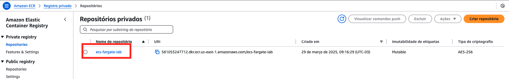
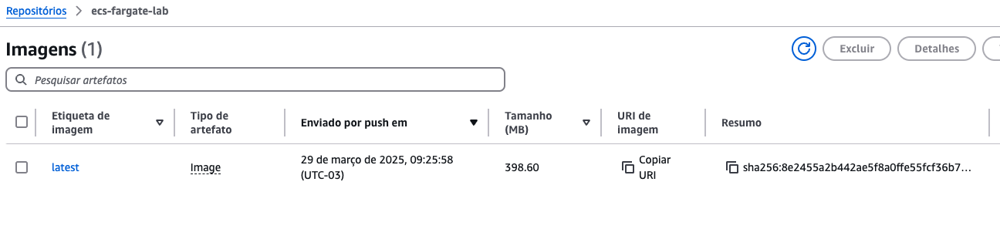

12.  Agora vamos até o ECS verificar se a task foi criada. Acesse o console do [ECS](https://us-east-1.console.aws.amazon.com/ecs/home?region=us-east-1#/clusters) e clique no cluster `ecs-fargate-lab-cluster`.

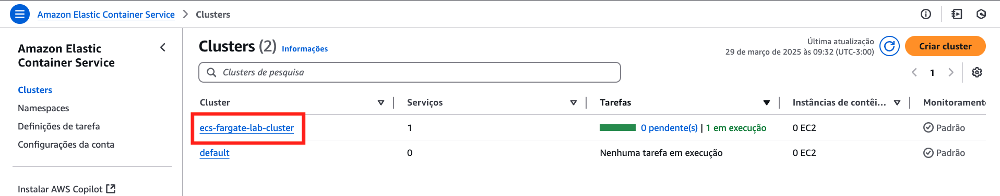

13. Na aba `Serviços` você consegue verificar se a tarea foi criada. Clique no serviço `ecs-fargate-lab-service` e verifique se a task foi criada.

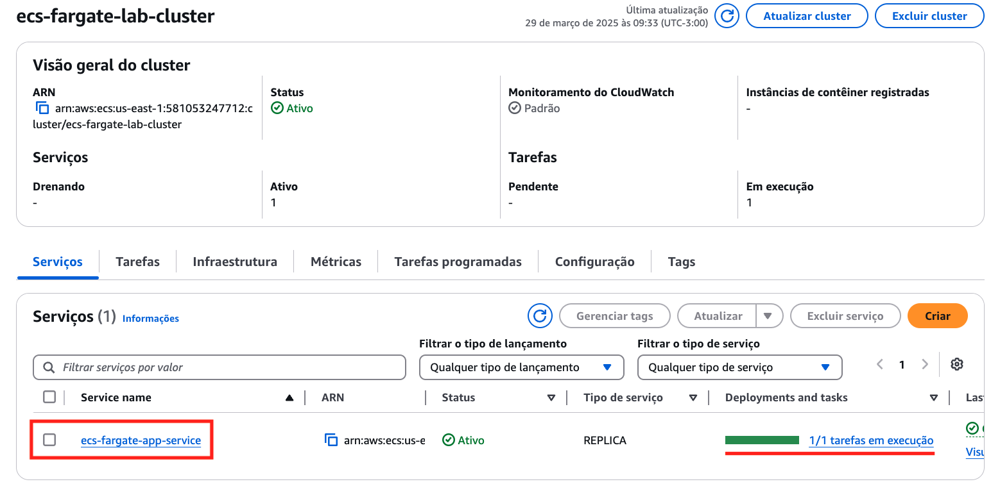

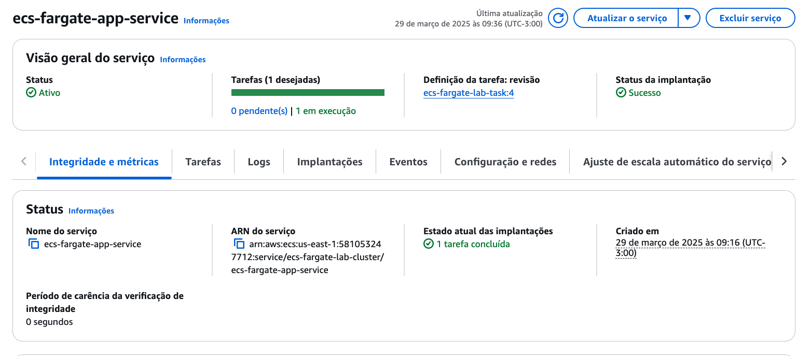

14. Para testar se esta tudo correto, você precisa do IP do fargate rodando. Para isso siga os passos abaixo:
    1.  Clique na aba `Tarefas`
     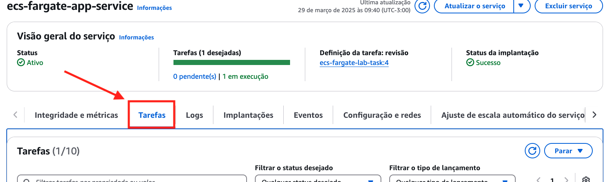

    2. Clique na tarefa em execução
     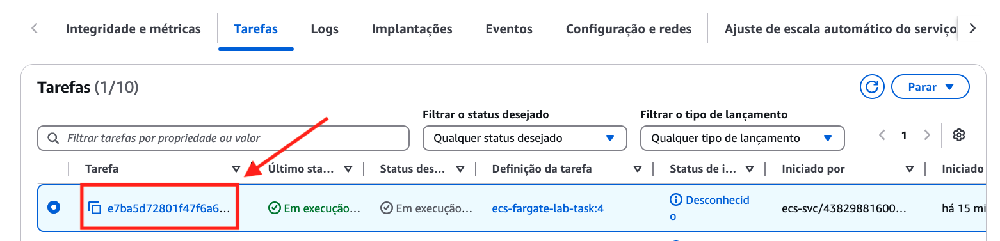
    3. Dentro da tarefa clique em `Associações de rede`
     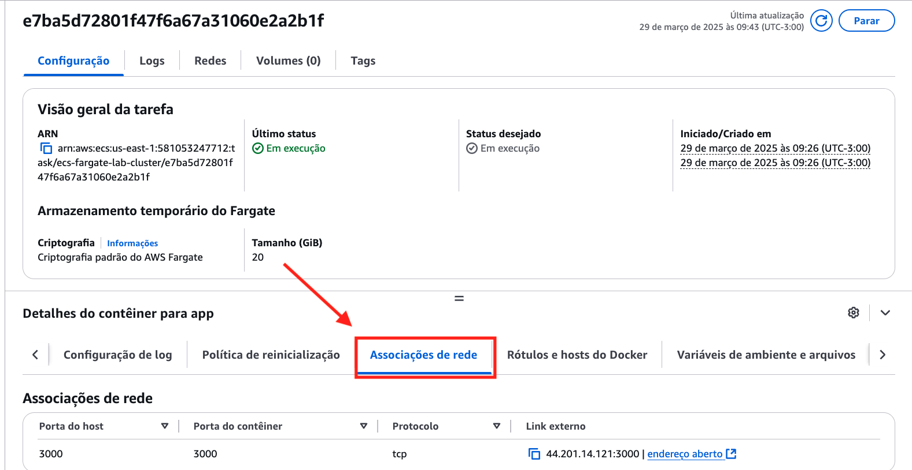
    4. Clique em `endereço aberto` para abrir uma nova aba com o IP do fargate
     
     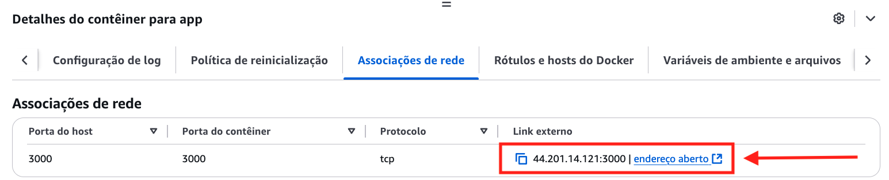
    5. Caso de certo você verá a tela abaixo
     
     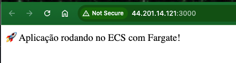
    6. Caso esteja conectado a rede da FIAP e não consiga acessar a porta 3000 via naveegador, copie o IP e utilize o terminal do codespaces para testar o acesso com o comando abaixo:
    ```bash
    curl http://IP_DO_FARGATE:3000
    ```
     

15. De volta ao **codespaces** execute o comando abaixo para destruir o ambiente:

```bash
cd /workspaces/fiap-arquitetura-compute-e-storage/03-Compute/02-ECS-Fargate/terraform
terraform destroy -auto-approve
```